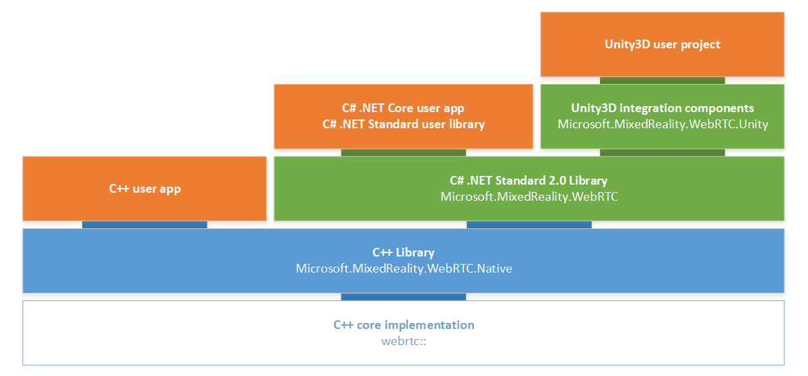

# MixedReality-WebRTC

[](https://github.com/microsoft/MixedReality-WebRTC/blob/master/LICENSE)

[](https://holodevelopers.slack.com/messages/CN1A7JB3R)

**⚠ PUBLIC PREVIEW ⚠**

**This repository currently contains a public preview under active development, intended for early adopters and to gather feedback. While in preview, the API is expected to be unstable and breaking changes will occur. See also the Known Issues section for details.**

MixedReality-WebRTC is a collection of libraries to help mixed reality app developers to integrate peer-to-peer real-time audio and video communication into their application and improve their collaborative experience.

- Enables **multi-track real-time audio / video / data communication** with a remote peer
- Provides an abstracted **signaling interface** to easily switch implementation
- Exposes an **API for C++ and C#** to integrate into existing apps
- Provides a set of **Unity3D components** for rapid prototyping and integration
- Includes support for Microsoft **HoloLens** (x86) and Microsoft **HoloLens 2** (ARM)
- Allows easy use of **[Mixed Reality Capture (MRC)](https://docs.microsoft.com/en-us/windows/mixed-reality/mixed-reality-capture)** to stream the view point of the user for multi-device experiences

MixedReality-WebRTC is part of the collection of repositories developed and maintained by the [Mixed Reality Sharing team](https://github.com/orgs/microsoft/teams/mixed-reality-sharing).

## Build Status

| Branch | WebRTC | C++ Library | C# Library | Docs |
|---|---|---|---|---|
| [`master`](https://github.com/microsoft/MixedReality-WebRTC/tree/master) | [m71](https://groups.google.com/forum/#!msg/discuss-webrtc/HUpIxlDlkSE/qR1nswqZCwAJ) | [](https://dev.azure.com/aipmr/MixedReality-WebRTC-CI/_build/latest?definitionId=24&branchName=master) | [](https://dev.azure.com/aipmr/MixedReality-WebRTC-CI/_build/latest?definitionId=25&branchName=master) | [](https://dev.azure.com/aipmr/MixedReality-WebRTC-CI/_build/latest?definitionId=26&branchName=master) |
| [`feature/m75`](https://github.com/microsoft/MixedReality-WebRTC/tree/feature/m75) | [m75](https://groups.google.com/forum/#!msg/discuss-webrtc/_jlUbYjv-hQ/Wd2mQgpOAgAJ) | [](https://dev.azure.com/aipmr/MixedReality-WebRTC-CI/_build/latest?definitionId=24&branchName=feature/m75) | [](https://dev.azure.com/aipmr/MixedReality-WebRTC-CI/_build/latest?definitionId=25&branchName=feature/m75) | [](https://dev.azure.com/aipmr/MixedReality-WebRTC-CI/_build/latest?definitionId=26&branchName=feature/m75) |

The current up-to-date branch with latest developments is the `master` branch. Initial support for WebRTC release M75 started on the `feature/m75` branch, but is not in a working state yet. See [#13](https://github.com/microsoft/MixedReality-WebRTC/issues/13) for details.

## Documentation

The official documentation is hosted at https://microsoft.github.io/MixedReality-WebRTC/.

- The [User Manual](https://microsoft.github.io/MixedReality-WebRTC/manual/introduction) contains a general overview and some tutorials.
  - The [Hello, Unity world!](https://microsoft.github.io/MixedReality-WebRTC/manual/helloworld-unity) tutorial introduces the Unity integration by building a simple chat client.
  - The Hello, C# world! tutorial (under construction) introduces the C# API.
- An [API reference](https://microsoft.github.io/MixedReality-WebRTC/api/Microsoft.MixedReality.WebRTC.html) is also available for the C# library and the Unity integration.

## Getting Started

MixedReality-WebRTC is a set of individual building blocks in the form of C++ and C# libraries building upon each other to deliver a consistent API to C++ and C# developers across its supported platforms, and a set of handful drop-in Unity3D components for easy integration.

### Overview

The overall architecture is as follow:



| Library | Lang | Description |
|---|---|---|
| `Microsoft.MixedReality.WebRTC.Native` | C++17 | Native C++ library providing a low-level interface to the [underlying WebRTC implementation from Google](https://opensource.google.com/projects/webrtc). Compared to the API exposed by the Google implementation (`PeerConnection`), the current interface is simplified to remove the burden of setup and configuring. It also tries to prevent common threading errors with the UWP wrappers. |
| `Microsoft.MixedReality.WebRTC` | C# 7.3 | C# .Net Standard 2.0 library providing access to the same API as the native C++ library, exposed with familiar C# concepts such as `async` / `await` and `Task`. |
| `Microsoft.MixedReality.WebRTC.Unity` | C# 7.3 | Unity3D integration - a set of Unity [`MonoBehaviour` components](https://docs.unity3d.com/ScriptReference/MonoBehaviour.html) with almost no required setup, to enable rapid prototyping and simplify integration into an existing app. |
| `Microsoft.MixedReality.WebRTC.Unity.Examples` | C# 7.3 | Unity3D samples showcasing typical use scenarios like a peer-to-peer video chat app. |

MixedReality-WebRTC is currently available for Windows 10 Desktop and UWP, with or without Unity, with planned support for Unity deployment on iOS and Android.

_Note_ - In the following and elsewhere in this repository the term "Win32" is used as a synonym for "Windows Desktop", the historical Windows API for Desktop application development, and in opposition to the "Windows UWP" API. However Microsoft Windows versions older than Windows 10 with Windows SDK 17134 (April 2018 Update, 1803) are not officially supported for this project. In particular, older versions of Windows (Windows 7, Windows 8, etc.) are explicitly not supported.

### Binary packages

MixedReality-WebRTC is currently under development, and precompiled binary packages for the project's libraries are not yet available. See the _Building MixedReality-WebRTC_ sections below for compiling those libraries from sources.

### Sources

This repository follows the [Pitchfork Layout](https://api.csswg.org/bikeshed/?force=1&url=https://raw.githubusercontent.com/vector-of-bool/pitchfork/develop/data/spec.bs) in an attempt to standardize its hierarchy:

```sh
bin/               # Binary outputs (generated)
build/             # Intermediate build artifacts (generated)
docs/              # Documentation
+ manual/          # User manual
examples/          # Examples of use and sample apps
external/          # Third-party external dependencies (git submodules)
libs/              # Source code for the individual libraries
tests/             # Source code for feature tests
tools/             # Utility scripts
+ build/           # Build scripts
+ ci/              # CI Azure pipelines
+ patches/         # Patches applied by build.ps1
```

The `Microsoft.MixedReality.WebRTC.sln` Visual Studio 2019 solution located at the root of the repository contains several projects:

- The native C++ library, which can be compiled:
  - for Windows Desktop with the `Microsoft.MixedReality.WebRTC.Native.Win32` project
  - for UWP with the `Microsoft.MixedReality.WebRTC.Native.UWP` project
- A C++ unit tests project `Microsoft.MixedReality.WebRTC.Native.Tests`
- The C# library project `Microsoft.MixedReality.WebRTC`
- A C# unit tests project `Microsoft.MixedReality.WebRTC.Tests`
- A UWP C# sample app project `Microsoft.MixedReality.WebRTC.TestAppUWP` based on WPF and XAML which demonstrates audio / video / data communication by mean of a simple video chat app.

_Note_ - Currently due to CI limitations some projects are downgraded to VS 2017, but will be reverted to VS 2019 eventually (see [#14](https://github.com/microsoft/MixedReality-WebRTC/issues/14)).

## Building MixedReality-WebRTC

See the user manual section on [Building from sources](https://microsoft.github.io/MixedReality-WebRTC/manual/building.html).

## Special considerations for HoloLens 2

- Mixed Reality Capture (MRC) has some inherent limitations:
  - **MRC only works up to 1080p** (see the [Mixed reality capture for developers](https://docs.microsoft.com/en-us/windows/mixed-reality/mixed-reality-capture-for-developers) documentation), but the default resolution of the webcam on HoloLens 2 is 2272 x 1278 (see the [Locatable Camera](https://docs.microsoft.com/en-us/windows/mixed-reality/locatable-camera) documentation). In order to access different resolutions, one need to use a different video profile, like the `VideoRecording` or `VideoConferencing` ones. This is handled automatically in the Unity integration layer (see [here](https://github.com/microsoft/MixedReality-WebRTC/blob/9a81c94cf01786398495f8046b645b7b28d987de/libs/Microsoft.MixedReality.WebRTC.Unity/Assets/Microsoft.MixedReality.WebRTC.Unity/Scripts/Media/LocalVideoSource.cs#L210-L237)) if `LocalVideoSource.Mode = Automatic` (default), but must be handled manually if using the C# library directly.
  - **MRC requires special permission** to record the content of the screen:
    - For shared apps (2D slates), this corresponds to the `screenDuplication` [restricted capability](https://docs.microsoft.com/en-us/windows/uwp/packaging/app-capability-declarations#restricted-capabilities), which **cannot be obtained by third-party applications**.
    - For exclusive-mode apps (fullscreen), there is no particular UWP capability, but the recorded content is limited to the application's own content.
- Be sure to use `PreferredVideoCodec = "H264"` to avail of the hardware encoder present on the device; software encoding with _e.g._ VP8 or VP9 codecs is very CPU intensive and strongly discouraged.

## Known Issues

The current version is a public preview under active development, which contains known issues being addressed:

- HoloLens 2 exhibits some small performance penalty due to the [missing support (#157)](https://github.com/webrtc-uwp/webrtc-uwp-sdk/issues/157) for SIMD-accelerated YUV conversion in WebRTC UWP SDK on ARM.
- There is currently no clean C++ API; instead the C API used for C# P/Invoke can be used from C++ code, and opaque handles cast to C++ objects. An actual C++ API will eventually be exposed.

In addition, the Debug config of WebRTC core implementation is known to exhibit some performance issues on most devices, including some higher end PCs. Using the Release config of the core WebRTC implementation usually prevents this.

## Contributing

This project welcomes contributions and suggestions.  Most contributions require you to agree to a Contributor License Agreement (CLA) declaring that you have the right to, and actually do, grant us the rights to use your contribution. For details, visit https://cla.microsoft.com.

When you submit a pull request, a CLA-bot will automatically determine whether you need to provide a CLA and decorate the PR appropriately (e.g., label, comment). Simply follow the instructions provided by the bot. You will only need to do this once across all repos using our CLA.

This project has adopted the [Microsoft Open Source Code of Conduct](https://opensource.microsoft.com/codeofconduct/). For more information see the [Code of Conduct FAQ](https://opensource.microsoft.com/codeofconduct/faq/) or contact [opencode@microsoft.com](mailto:opencode@microsoft.com) with any additional questions or comments.

## Reporting security issues and bugs

MixedReality-WebRTC builds upon the WebRTC implementation provided by Google. Security issues and bugs related to this implementation should be reported to Google.

Security issues and bugs related to MixedReality-WebRTC itself or to WebRTC UWP SDK should be reported privately, via email, to the Microsoft Security Response Center (MSRC) secure@microsoft.com. You should receive a response within 24 hours. If for some reason you do not, please follow up via email to ensure we received your original message. Further information, including the MSRC PGP key, can be found in the [Security TechCenter](https://technet.microsoft.com/en-us/security/ff852094.aspx).
