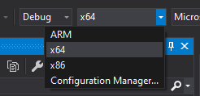
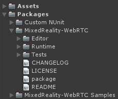

# Building from sources (Windows)

The MixedReality-WebRTC libraries for Windows platforms (Desktop and UWP) are built from the `Microsoft.MixedReality.WebRTC.sln` Visual Studio solution located at the root of the git repository.

## Prerequisites

### Environment and tooling

- The low-level WebRTC implementation from Google (`webrtc.lib`) requires in total approximately **20 GB of disk space** when built for all supported Windows variants.

- Due to Windows paths length limit, it is recommended to **clone the source repository close to the root** of the filesystem, _e.g._ `C:\mr-webrtc\` or similar, as the recursive external dependencies create a deep hierarchy which may otherwise produce paths beyond the OS limit and result in build failure.

- The solution uses **Visual Studio 2019** with the following features:

  - The **MSVC v141 - VS 2017 C++ x64/x86 build tools** toolchain from Visual Studio **2017** is required to build the C++17 library of MixedReality-WebRTC. This will eventually be replaced with the Visual Studio **2019** compiler (v142 toolchain) once the project is upgraded to a Google milestone supporting Visual Studio 2019 (see details on [issue #14](https://github.com/microsoft/MixedReality-WebRTC/issues/14))

  - For ARM support, the **MSVC v141 - VS 2017 C++ ARM build tools** toolchain is also required.

  - The C# library requires a .NET Standard 2.0 compiler, like the Roslyn compiler available as part of Visual Studio when installing the **.NET desktop development** workload.

  - The UWP libraries and projects require UWP support from the compiler, available as part of Visual Studio when installing the **Universal Windows Platform development** workload.

- The Unity library is officially supported for [Unity](https://unity3d.com/get-unity/download) version **2018.4.x** (LTS) and **2019.4.x** (LTS). However, we do our best to keep things working on other versions too where possible. Versions earlier than 2018.4.x may work but are not tested at all, and no support will be provided for those.

## Cloning the repository

The official repository containing the source code of MixedReality-WebRTC is [hosted on GitHub](https://github.com/microsoft/MixedReality-WebRTC). The latest developments are done on the `master` branch, while the latest stable release is a `release/*` branch.

Clone the choosen branch of the repository and its dependencies **recursively**, preferably close to the root of the filesystem (see prerequisites):

```cmd
git clone --recursive https://github.com/microsoft/MixedReality-WebRTC.git -b <branch_name> C:\mr-webrtc
```

Note that **this may take some time (> 5 minutes)** due to the large number of submodules in [the WebRTC UWP SDK repository](https://github.com/webrtc-uwp/webrtc-uwp-sdk) this repository depends on.

### Building the core WebRTC implementation

The so-called _Core_ implementation is constituted of:

- `webrtc.lib` : A static library containing the Google implementation of the WebRTC standard.
- `Org.WebRtc.winmd` : A set of WinRT wrappers for accessing the WebRTC API from UWP.

Those libraries require several extra prerequisites. They are also complex and time-consuming to build. Therefore to save time and avoid headache a build script is provided in `tools\build\build.ps1` which checks for most prerequisites and build a single variant of `webrtc.lib`.

```powershell
cd tools\build
.\build.ps1 -BuildConfig Release -BuildArch x64 -BuildPlatform Win32   # Desktop x64, e.g. Unity Editor
.\build.ps1 -BuildConfig Release -BuildArch ARM -BuildPlatform UWP     # UWP ARM, e.g. HoloLens 2
[...]
```

Not all build variants need to be built; you can build only the one(s) necessary for your target device(s).

## Building the MixedReality-WebRTC libraries

1. Open the `Microsoft.MixedReality.WebRTC.sln` Visual Studio solution located at the root of the freshly cloned repository.

2. Select the build variant with the Solution Configuration selector at the top of the window under the main menu.

   

   - Choose the build configuration (`Debug` or `Release`); generally it is recommended to always use the `Release` configuration, as the `Debug` configuration of the underlying `webrtc.lib` implementation used by the native C library can be notably slow in `Debug`.
   - Choose the build architecture corresponding to the variant needed:
     - `x86` for the 32-bit Windows Desktop and UWP variants
     - `x64` for the 64-bit Windows Desktop and UWP variants; this includes the x64 Desktop variant required by the Unity editor
     - `ARM` for the 32-bit Windows UWP ARM variant

3. Build the solution with **Build > Build Solution**. This builds only 2 build variants (Desktop and UWP) for the selected architecture and build configuration. If you need other variants, repeat from step 2. and select them.

On successful build, the binaries will be generated in a sub-directory under `bin/`, and the relevant DLLs will be copied by a post-build script to `libs\unity\library\Runtime\Plugins\` for the Unity library to consume them.

## Copying the binaries

_Note: This section describes manual copying in case the Visual Studio solution is not used or the automated copying does not work for any reason. If the solution built successfully, the binaries should already have been copied (see above)._

The C# library `Microsoft.MixedReality.WebRTC.dll` is a .NET Standard 2.0 library. This means it is compatible with all CPU architectures. The C# library is available from `bin\netstandard2.0\Debug` or `bin\netstandard2.0\Release` depending on the build configuration which was compiled. In doubt you should use the `Release` configuration, which can provide better performance. This module needs to be copied somehwere into the `libs\unity\library\Runtime\Plugins\` folder of the git repository checkout. This is done automatically by the build process of the Visual Studio solution, but can also be done via the command line with `xcopy`, assuming that the git repository of MixedReality-WebRTC was cloned in `D:\mr-webrtc`:

```cmd
cd /D D:\testproj
xcopy D:/mr-webrtc/bin/netstandard2.0/Release/Microsoft.MixedReality.WebRTC.dll libs/unity/library/Runtime/Plugins/Win32/x86_64/
```

_Note_: By convention, and because of past experiences of getting errors when doing otherwise, the C# library is copied to the `Win32\x86_64` sub-folder where the native C library for the Unity editor is also located. It is unclear if this is best practice, as the Unity documentation is outdated on this topic.

For the native C library `mrwebrtc.dll` things are a bit more complex. The DLL is compiled for a particular platform and architecture, in addition of the Debug or Release build configurations, and the correct variant needs to be used. On Windows, the Unity Editor needs a **64-bit Desktop** variant (`Debug` or `Release`); it is available from the `bin\Win32\x64\Release` folder (`Win32` is an alias for `Desktop`), and should be copied to the `libs\unity\library\Runtime\Plugins\Win32\x86_64\` folder. Again this is done automatically by the Visual Studio build process, but can be done manually with the following commands:

```cmd
cd /D D:\testproj
xcopy D:/mr-webrtc/bin/Win32/x64/Release/mrwebrtc.dll libs/unity/library/Runtime/Plugins/Win32/x86_64/
```

## Importing the library

Once the necessary binaries have been added to `libs\unity\library\Runtime\Plugins`, the Unity library UPM package can be imported into any number of Unity projects.

> [!WARNING]
>
> It is critical to setup the binaries first, before importing into a project and opening the Unity editor, otherwise the import settings might get overwritten by Unity. See [Configuring the import settings](#configuring-the-import-settings) below for details.

The Unity library already has the proper layout on disk of a UPM package, and a `package.json` file is provided. This means the package can be imported simply by following [the official Unity instructions for installing a local package](https://docs.unity3d.com/Manual/upm-ui-local.html).

## Configuring the import settings

_Note: This step is normally not necessary, as the `.meta` files are already checked in the git repository and properly configured. It can happen that Unity deletes and recreates those files, therefore the configuration process is explained in details here anyway._

> [!IMPORTANT]
> **Be sure to build the binaries before importing the Unity library package into any Unity project.** As part of the build, the libraries are copied to the `Plugins` folder of the Unity library. There are already some associated `.meta` files, which have been committed to the git repository, to inform Unity of the platform of each DLL and how to deploy it. If the Unity project is opened first, before the DLLs are present, Unity will assume those `.meta` files are stale and will delete them, and then later will recreate some with a different default config once the DLLs are copied. This leads to errors about modules with duplicate names. If done correctly then none of the below is necessary.

The git repository comes with pre-configured `.meta` files already setup. However we detail below the manual steps to configure those `.meta` files for the sake of clarity, and in case Unity deleted those files because the binaries have not been built yet (although using `git reset` is a faster and safer way to recover them), or if users want to get rid of the UPM package and incorporate a custom copy of the MixedReality-WebRTC into their Unity project and modify it.

When building a Unity application for a given platform, another variant of the MixedReality-WebRTC native C/C++ library than the one the Unity editor uses may be required to deploy on that platform. In order for the C# library to be truly platform-independent, the name of all native C/C++ library variants is the same: `mrwebrtc`. This allows the C# code to reference that DLL with [the same `DllImport` attribute path](https://docs.microsoft.com/en-us/dotnet/api/system.runtime.interopservices.dllimportattribute?view=netcore-3.1). But this also means that multiple files with the same name exist in different folders, and Unity needs to know which one is associated with which build variant, to be able to deploy the correct one only. This is done by configuring the platform associated with a DLL in the import settings in the Unity inspector.

When importing a UPM package into a Unity project, the content of the UPM package can be accessed from the **Packages** group of the **Project** window.



To configure the import settings:

- In the **Project** window, select one of the `mrwebrtc.dll` files from the `Plugins` folder.
- The **Inspector** window now shows the import settings for the selected file, which contains option to configure the deploy platform(s) and architecture(s).

For example, by selecting in the **Inspector** window:

- **Include Platforms: WSAPlayer**, the DLL will be used by Unity on UWP platforms. _WSAPlayer_ is the name Unity uses for its UWP standalone player.
- **CPU** equal to **x86_64**, Unity will only deploy that DLL when deploying on a 64-bit Intel architecture.

This way, multiple variants of the same-named `mrwebrtc.dll` can co-exist in different sub-folders of `Assets/Plugins/` and Unity will deploy and use the correct variant on each platform.

> [!NOTE]
> If Unity complains about "_Multiple plugins with the same name 'mrwebrtc'_", then the configurations of the various `mrwebrtc.dll` files are not exclusive, and 2 or more files have been allowed for deploying on the same platform. Check the configuration of all variants again.

For **Windows Desktop**, the native implementation DLL variants are:

| Path | Include Platforms | Settings | Example use |
|---|---|---|---|
| `Plugins/Win32/x86` | Standalone | x86 | 32-bit Windows Desktop application |
| `Plugins/Win32/x86_64` | Editor | CPU = x86_64, OS = Windows | Unity Editor on Windows |
| | Standalone | x86_64 | 64-bit Windows Desktop application |

For **Windows UWP**, the native implementation DLL variants are:

| Path | Include Platforms | SDK | CPU | Example use |
|---|---|---|---|---|
| `Plugins/UWP/x86` | WSAPlayer | UWP | X86 | Microsoft HoloLens (1st gen) |
| `Plugins/UWP/x86_64` | WSAPlayer | UWP | X64 | 64-bit UWP Desktop app on Windows |
| `Plugins/UWP/ARM` | WSAPlayer | UWP | ARM | HoloLens 2 (compatibility) |

> [!NOTE]
> UWP ARM64 is not supported. The ARM (32-bit) architecture variant can be used as a fallback on HoloLens 2 and other devices which support running 32-bit ARM applications on ARM64 hardware.

For **Android**, the native implementation archive `mrwebrc.aar` is configured as:

| Path | Include Platforms | Example use |
|---|---|---|
| `Plugins/Android/arm64-v8a` | Android | Android phone |

In all cases the "Any Platform" setting must be unchecked.

If all variants are installed, the resulting hierarchy should look like this in the **Project** window:

```shell
Plugins
├─ Android
|  └─ arm64-v8a
|     └─ mrwebrtc.aar
├─ Win32
|  ├─ x86
|  |  └─ mrwebrtc.dll
|  └─ x86_64
|     └─ mrwebrtc.dll
└─ UWP
   ├─ x86
   |  └─ mrwebrtc.dll
   ├─ x86_64
   |  └─ mrwebrtc.dll
   └─ ARM
      └─ mrwebrtc.dll
```

Note that the `.meta` files where the import settings are saved do not appear in the **Project** window.

## Testing the build

Test the newly built libraries by _e.g._ running some of the Windows Desktop tests:

1. Build the `mrwebrtc-win32-tests` after selecting a Solution Configuration including the `x86` or `x64` architecture.

2. Run it by right-clicking on the project and selecting **Debug** > **Start New Instance** (or F5 if the project is configured as the Startup Project). Alternatively, the test program uses Google Test and integrates with the Visual Studio Test Explorer, so tests can be run from that panel too.

----

_Next_ : [Building the C# library](building-cslib.md)
