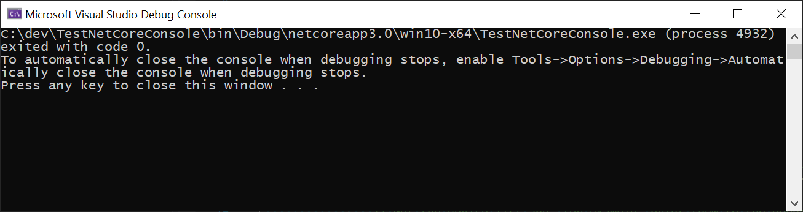

# Creating a project

In this tutorial we use [.NET Core 3.0](https://dotnet.microsoft.com/download/dotnet-core/3.0) to create a C# Desktop application. Because there is currently no simple solution to display raw video frames from a .NET Core application, like there is with UWP, we will limit this tutorial to creating a simple console application without graphics. Think of it as a recording tool to broadcast audio and/or video to a remote device.

> [!Note]
> This tutorial assumes that the host device where the app will be running during the tutorial has access to:
> - a webcam, or any other video capture device recognized by WebRTC
> - a microphone, or any other audio capture device recognized by WebRTC

## Install .NET Core 3.0

Download the latest .NET Core 3.0 **SDK** (and not Runtime) from its [download page](https://dotnet.microsoft.com/download/dotnet-core/3.0) and install it.

> [!Warning]
> Visual Studio v16.3 or later is required, otherwise the console application might not run correctly inside Visual Studio.

## Generate the project

Open a terminal and use the `dotnet` command to create a new project from the `console` template. We will name this tutorial project `TestNetCoreConsole`.

```
dotnet new console --name TestNetCoreConsole
```

This generates a folder named `TestNetCoreConsole` which contains the following notable files:
- **`TestNetCoreConsole.csproj`** : The C# project
- **`Program.cs`** : The C# source code for the application

> [!Note]
> Starting Visual Studio v16.3, this project can also be generated from the Visual Studio wizard by creating a new project and selecting **Console App (.NET Core)**, which will default to .NET Core 3.0. Previous versions of Visual Studio default to .NET Core 2.1 or lower. 

## Open the .NET Core project in Visual Studio 2019

Open the C# project generated earlier (`TestNetCoreConsole.csproj`), then build and run it, either by pressing **F5** or selecting in the menu **Debug** > **Start Debugging**. After the project built successfully, a terminal window should appear.



> [!Note]
> The project can alternatively be built on the command line with `dotnet build`, and launched with `dotnet run` (which implies building). Executing a `dotnet run` returns immediately, since the empty generated program does not currently output anything.

## Add a dependency to MixedReality-WebRTC

In order to use the MixedReality-WebRTC project in this new `TestNetCoreConsole` app, we will add a dependency to its C# NuGet package hosted on [nuget.org](https://www.nuget.org/). This is by far the easiest way, although a locally-built copy of the `Microsoft.MixedReality.WebRTC.dll` assembly could also be alternatively used (but this is out of the scope of this tutorial).

There are again multiple ways to add a reference to this NuGet package, in particular via the Visual Studio NuGet package manager for the project, or via the `dotnet` command line. For simplicity, we show here how to do so the `dotnet` way, which simply involves typing a single command from within the project folder.

```
dotnet add TestNetCoreConsole.csproj package Microsoft.MixedReality.WebRTC
```

This will download from [nuget.org](https://www.nuget.org/) and install the `Microsoft.MixedReality.WebRTC.nupkg` NuGet package, which contains the same-named assembly, as well as its native dependencies (x86 and x64) for the Windows Desktop platform.

> [!Note]
> `dotnet` may complain about being unable to find a stable package, if no stable package has been released yet. Remember that `dotnet` only install stable packages by default, you can force a specific non-stable version with the `--version` option.

After that, `TestNetCoreConsole.csproj` should contain a reference to the package, with a version corresponding to the latest stable version found on [nuget.org](https://www.nuget.org/), or the one you specified with the `--version` option.

```xml
<ItemGroup>
  <PackageReference Include="Microsoft.MixedReality.WebRTC" Version="..." />
</ItemGroup>
```

## Test the reference

In order to ensure everything works fine and the `Microsoft.MixedReality.WebRTC` assembly can be used, we will use one of its functions to list the video capture devices, as a test. This makes uses of the static method [`PeerConnection.GetVideoCaptureDevicesAsync()`](xref:Microsoft.MixedReality.WebRTC.PeerConnection.GetVideoCaptureDevicesAsync). This is more simple than creating objects, as there is no clean-up needed after use.

Edit the `Program.cs` file:

1. At the top of the file, add some `using` statement to import the `Microsoft.MixedReality.WebRTC` assembly. Also import the `System.Threading.Tasks` module, as we will use the `async` / `await` construct and the `Task` object.
   ```cs
   using System.Threading.Tasks;
   using Microsoft.MixedReality.WebRTC;
   ```

2. Modify the signature of the `Main` function to make it asynchronous, by changing its return type from `void` to `Task` and adding the `async` keyword. This allows using the `await` keyword inside its body.
   ```cs
   static async Task Main(string[] args)
   ```

3. Change the body of the `Main` function to call [`GetVideoCaptureDevicesAsync()`](xref:Microsoft.MixedReality.WebRTC.PeerConnection.GetVideoCaptureDevicesAsync) and display the list of devices found on the standard output.
   ```cs
   static async Task Main(string[] args)
   {
       try
       {
           // Asynchronously retrieve a list of available video capture devices (webcams).
           var deviceList = await PeerConnection.GetVideoCaptureDevicesAsync();

           // For example, print them to the standard output
           foreach (var device in deviceList)
           {
               Console.WriteLine($"Found webcam {device.name} (id: {device.id})");
           }
       }
       catch (Exception e)
       {
           Console.WriteLine(e.Message);
       }
   }
   ```

Launch the application again. This time the terminal window shows a list of devices. This list depends on the actual host device (computer) where the application is running, but looks something like:
```
Found webcam <some webcam name> (id: <some long ID>)
```

Note that there might be multiple lines if multiple capture devices are available, which is unusual but can happen _e.g._ if you plug a USB webcam into a laptop which already has an integrated webcam. In general the first capture device listed will be the default one used by WebRTC, although it is possible to explicitly select a device (see [`PeerConnection.AddLocalVideoTrackAsync()`](xref:Microsoft.MixedReality.WebRTC.PeerConnection.AddLocalVideoTrackAsync(Microsoft.MixedReality.WebRTC.PeerConnection.LocalVideoTrackSettings)) for more details).

----

Next : [Creating a peer connection](helloworld-cs-peerconnection-core3.md)
