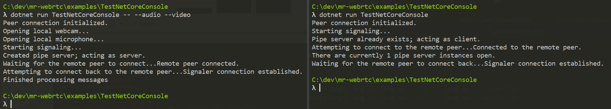

# A custom signaling solution

_Signaling_ is the process of communicating with a remote endpoint with the intent of establishing a peer-to-peer connection. The WebRTC standard does not enforce any specific protocol or solution for WebRTC signaling; instead it simply states that some opaque messages must be transported between the remote peers by whatever mean the developer choses, its _signaling solution_.

## NamedPipeSignaler

In this chapter we use the `NamedPipeSignaler` found in `examples/NamedPipeSignaler`. This is a simple signaling solution based as the name implies on named pipes, which allows local peer discovery and connection out of the box on a local host without any configuration. This is not a production-ready solution, but for this tutorial it has the benefit of being very simple.

### Install

The easiest way to consume the `NamedPipeSignaler` class in the `TestNetCoreConsole` sample app is to copy the `examples/NamedPipeSignaler/NamedPipeSignaler.cs` file alongside the `TestNetCoreConsole.csproj` project. This avoids the need for any reference setup in the project, or any other kind of configuration.

### Pipe creation

There is no need to understand how the `NamedPipeSignaler` class works for this tutorial. But for the sake of curiosity, this is how the connection is established (you can skip to the **Setup the signaler** section below if not interested):
- Try to create a pipe server.
  - If that succeeds, then this peer is the first peer and will _act as server_. 
  - If that fails, then another peer already created that pipe server, so this peer will _act as client_.
- If acting as server:
  - Wait for the remote peer to connect its client pipe to this server.
  - Create a _reverse_ pipe client and connect to the _reverse_ pipe server of the remote peer.
- If acting as client:
  - Connect to the pipe server created by the other peer.
  - Create a _reverse_ pipe server, and wait for the server to connect back with its _reverse_ pipe client.
- At this point, both peer have a client pipe for sending data and a server pipe for receiving data, and can communicate.
- Start a background task to read incoming messages from the remote peer, and wait.

## Setup the signaler

Continue editing the `Program.cs` file and append the following:

1. Create a signaler associated with the existing peer connection.
   ```cs
   var signaler = new NamedPipeSignaler.NamedPipeSignaler(pc, "testpipe");
   ```

2. Connect handlers to the signaler's messages, and forward them to the peer connection.
   ```cs
   signaler.SdpMessageReceived += (string type, string sdp) => {
       pc.SetRemoteDescription(type, sdp);
       if (type == "offer")
       {
           pc.CreateAnswer();
       }
   };

   signaler.IceCandidateReceived += (string candidate, int sdpMlineindex, string sdpMid) => {
       pc.AddIceCandidate(sdpMid, sdpMlineindex, candidate);
   };
   ```

3. Start the signaler and connect it to the remote peer's signaler.
   ```cs
   await signaler.StartAsync();
   ```
   This last call will block until the two signalers are connected with each other.

At this point the signaler is functional. However as pointed above it will wait for a second instance of the `TestNetCoreConsole` app to connect. But currently this cannot work, because both instances will attempt to capture the webcam and microphone, and one of them will fail to do so.

## Optional audio and video capture

In order to test the signaler with 2 instances of `TestNetCoreConsole`, we need one of those to *not* attempt to open the audio and video capture devices. For this, we had some command-line arguments to control the audio and video capture.

Continue editing the `Program.cs` file:

1. At the top of the `Main` function, check if the audio and video capture arguments are present on the command-line arguments provided by the user. We name those arguments `-v`/`--video` to enable video capture, and `-a`/`--audio` to enable audio capture.
   ```cs
   bool needVideo = Array.Exists(args, arg => (arg == "-v") || (arg ==    "--video"));
   bool needAudio = Array.Exists(args, arg => (arg == "-a") || (arg ==    "--audio"));
   ```

2. Wrap the calls to `AddLocal(Audio|Video)TrackAsync` into `if` blocks using the boolean just defined. We also print some console message, so that the user can confirm whether the flags were indeed taken into account. This is useful to avoid mistakes since we will be running 2 instances of the app, one with the flags and one without.
   ```cs
   // Record video from local webcam, and send to remote peer
   if (needVideo)
   {
       Console.WriteLine("Opening local webcam...");
       await pc.AddLocalVideoTrackAsync();
   }
   
   // Record audio from local microphone, and send to    peer
   if (needAudio)
   {
       Console.WriteLine("Opening local microphone...");
       await pc.AddLocalAudioTrackAsync();
   }
   ```

## Establishing a signaler connection

At this point the sample app is ready to establish a _signaler_ connection. That is, 2 instances of the `TestNetCoreConsole` app can be launched, and their `NamedPipeSignaler` instances will connect together. Note however that we are not done yet with the peer connections, so the WebRTC peer-to-peer connection itself will not be established yet.

Start 2 instances of the sample app:
- one with the audio/video flags, the _capturer_
- one without any flag, the _receiver_

**Terminal #1 (capturer)**
```
dotnet run TestNetCoreConsole -- --audio --video 
```

**Terminal #2 (receiver)**
```
dotnet run TestNetCoreConsole
```

The two terminals should print some messages and eventually indicate that the connection was successful:
```
Signaler connection established.
```



----

Next : [Establishing a WebRTC connection](helloworld-cs-connection-core3.md)
