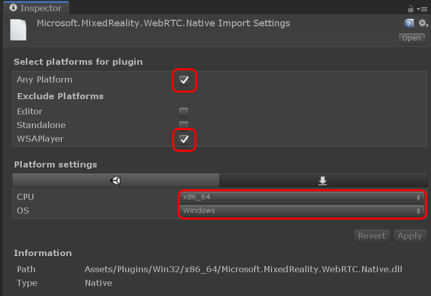
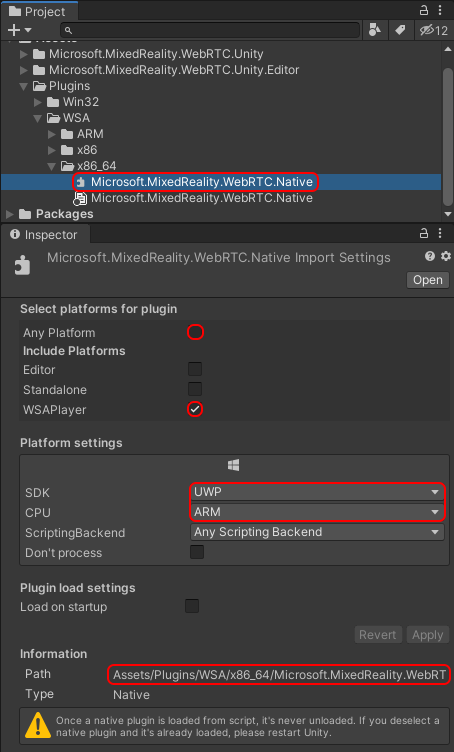

# Importing MixedReality-WebRTC

In order to use the Unity integration, the following components are required:

- C++ library : `Microsoft.MixedReality.WebRTC.Native.dll` (one variant per platform/architecture)
- C# library : `Microsoft.MixedReality.WebRTC.dll` (single universal module for all platforms/architectures)
- Unity integration scripts and assets

There is currently no pre-packaged distribution method for Unity, so users have to manually copy the relevant files into their Unity project.

## Copying the libraries

The libraries can be copied either from a local build of the solution, of from the NuGet packages. The latter does not require any building, but is generally only available for the latest stable release, so will be missing any newer development available on the `master` branch. The former allows accessing the latest features, but may contain some API breaking changes since the latest stable release, so may require some code changes when upgrading an existing project using an earlier API version.

### NuGet packages

The C++ and C# libraries of MixedReality-WebRTC are available precompiled via NuGet packages. See the [GitHub Releases page](https://github.com/microsoft/MixedReality-WebRTC/releases) for the latest packages.

The packages can be downloaded from nuget.org, and once downloaded can be extracted by simply changing their extension from `.nupkg` to `.zip` and using any standard ZIP archive extraction method. Once extracted, the DLLs can be copied as detailed on the **Unity integration** section of the [installation page](installation.md).

### Local solution build

If the C++ and C# libraries are compiled from sources as explained in the [Building](building.md) page, they are available in one of the sub-folders under the `<root>/bin/` folder of the MixedReality-WebRTC project.

Note that **the copy is automatically done by a build script when compiling via the provided Visual Studio solution**. The steps below are only required if the libraries are compiled in another way. Otherwise you can skip to the next step to _Configure the import settings_.

The C# library `Microsoft.MixedReality.WebRTC.dll` is a .NET Standard 2.0 library. This means it is compatible with all CPU architectures. This is often referred to as "AnyCPU", and the C# library is therefore available from `bin\AnyCPU\Debug` or `bin\AnyCPU\Release` depending on the build configuration which was compiled. In doubt you can use the `Release` configuration, which provides better performance. This module needs to be copied somewhere into the `Assets\Plugins\` folder of the Unity project (if that folder doesn't exist you can create it). On Windows this can be done via the command line with `xcopy`, assuming that the MixedReality-WebRTC project is located in `D:\mr-webrtc`:

```
cd /D D:\testproj
xcopy D:/mr-webrtc/bin/AnyCPU/Release/Microsoft.MixedReality.WebRTC.dll Assets/Plugins/
```

For the C++ library `Microsoft.MixedReality.WebRTC.Native.dll` things are a bit more complex. The C++ code is compiled for a particular platform and architecture, in addition of the Debug or Release build config, and the correct variant needs to be used. On Windows, the Unity Editor needs a 64-bit Desktop variant; it is available from the `bin\Win32\x64\Release` folder, and should be copied to the `Assets\Plugins\Win32\x86_64\` folder.

```
cd /D D:\testproj
xcopy D:/mr-webrtc/bin/Win32/x64/Release/Microsoft.MixedReality.WebRTC.Native.dll Assets/Plugins/Win32/x86_64/
```

## Configuring the import settings

 When building the Unity application for a given platform, another variant may be required. In order for the C# library to be truly platform-independent, the name of all C++ library variants is the same. This allows the C# code to reference the C++ library with [the same `DllImport` attribute path](https://docs.microsoft.com/en-us/dotnet/api/system.runtime.interopservices.dllimportattribute?view=netcore-2.1). But this also means that Unity needs to know which copy is associated with which build variant, to be able to deploy the correct one. This is done by configuring the platform associated with a DLL in the import settings in the Unity inspector:



By selecting:

- **Any Platform** except **WSAPlayer**, the DLL will be used by Unity on all platforms except when deploying for UWP. _WSAPlayer_ is the name Unity uses for its UWP standalone player.
- **CPU** equal to **x86_64**, Unity will only deploy that DLL when deploying on a 64-bit Intel architecture.

This way, multiple variants of the same-named `Microsoft.MixedReality.WebRTC.Native.dll` can co-exist in different sub-folders of `Assets/Plugins/` and Unity will deploy and use the correct variant on each platform.

For **Windows Desktop**, the C++ library variants are:

| Path | Any Platform | Exclude Platforms | CPU | OS | Example use |
|---|---|---|---|---|---|
| `Assets/Plugins/Win32/x86` | yes | -WSAPlayer | x86 | Windows | 32-bit Windows Desktop application |
| `Assets/Plugins/Win32/x86_64` | yes | -WSAPlayer | x86_64 | Windows | 64-bit Windows Desktop application, including the Unity Editor on Windows |

For **Windows UWP**, the C++ library variants are:

| Path | Any Platform | Include Platforms | SDK | CPU | Example use |
|---|---|---|---|---|---|
| `Assets/Plugins/UWP/x86` | no | +WSAPlayer | UWP | X86 | Microsoft HoloLens |
| `Assets/Plugins/UWP/x86_64` | no | +WSAPlayer | UWP | X64 | 64-bit UWP Desktop app on Windows |
| `Assets/Plugins/UWP/ARM` | no | +WSAPlayer | UWP | ARM | HoloLens 2 (compatibility) |
| `Assets/Plugins/UWP/ARM64` | no | +WSAPlayer | UWP | ARM64* | HoloLens 2 |

_*ARM64 is only available on Unity 2019.1+_



If all variants are installed, the resulting hierarchy should look like this:

```
Assets
+- Plugins
   +- Win32
   |  +- x86
   |  |  +- Microsoft.MixedReality.WebRTC.Native.dll
   |  +- x86_64
   |     +- Microsoft.MixedReality.WebRTC.Native.dll
   +- UWP
      +- x86
      |  +- Microsoft.MixedReality.WebRTC.Native.dll
      +- x86_64
      |  +- Microsoft.MixedReality.WebRTC.Native.dll
      +- ARM
      |  +- Microsoft.MixedReality.WebRTC.Native.dll
      +- ARM64
         +- Microsoft.MixedReality.WebRTC.Native.dll
```

## Importing the Unity integration

In order to import the Unity integration into your new Unity project, simply copy the `libs\Microsoft.MixedReality.WebRTC.Unity\Assets\Microsoft.MixedReality.WebRTC.Unity` and `libs\Microsoft.MixedReality.WebRTC.Unity\Assets\Microsoft.MixedReality.WebRTC.Unity.Editor` folders into the `Assets` folder of your project. The former provides the integration itself, while the later contains some helpers for the Unity Editor. Those helpers are only needed in the Editor, and not when the application is deployed at runtime.

After Unity finished processing the new files, the **Project** window should look like this:


