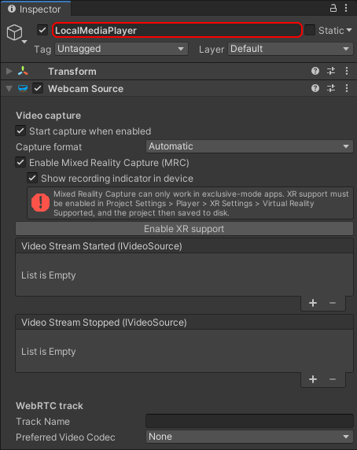
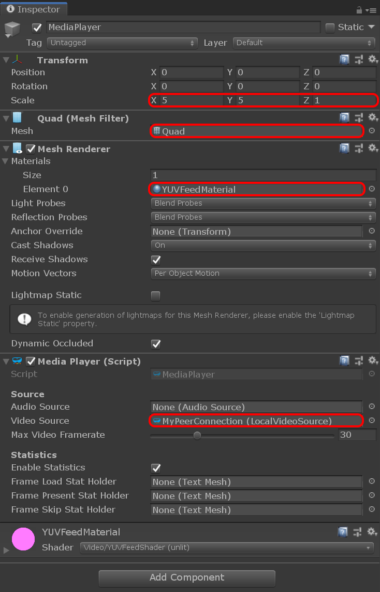
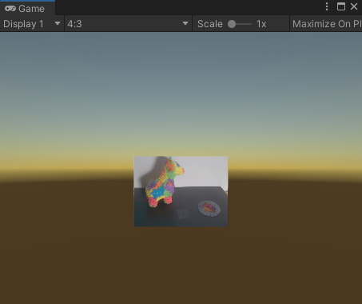

# Adding local video

There are two different aspects covered by the concept of _local video_:

- Capturing some video feed from a local camera to send it to the remote peer
- Displaying locally the captured video feed

Both are optional, although the second one alone simply corresponds to capturing a displaying a local webcam and doesn't require WebRTC. So we generally want the first one in a scenario where an application needs WebRTC. The second one is application-dependent, and even within one given application can be toggled ON and OFF by the user.

Both cases however are covered by the [`LocalVideoSource`](xref:Microsoft.MixedReality.WebRTC.Unity.LocalVideoSource) component. This components serves as a bridge between a local video capture device (camera), the peer connection, and an optional video player to render the video feed locally.

## Adding a local video source

For clarity we will create a new game object and add a [`LocalVideoSource`](xref:Microsoft.MixedReality.WebRTC.Unity.LocalVideoSource) component. It may sound superfluous at the moment to create a new game object, as we could add the local video source to the same game object already owning the peer connection component, but this will prove more clear and easy to manipulate later.

- In the **Hierarchy** window, select **Create** > **Create Empty**.
- In the **Inspector** window, rename the newly-created game object to something memorable like "LocalMediaPlayer".
- Press the **Add Component** button at the bottom of the window, and select **MixedReality-WebRTC** > **LocalVideoSource**.
- This component needs to know which peer connection to use. Once again, use the asset selection window to assign our peer connection to the **Peer Connection** property.

The local video source component contains several interesting properties:

- The **Auto Start Capture** property instructs the component to open the video capture device (webcam) automatically as soon as possible. This enables starting local video playback even before the peer connection is established.
- The **Enable Mixed Reality Capture** property tells the component it should attempt to open the video capture device with MRC enabled, if supported.
- The **Auto Add Track** property allows automatically adding a video track to the peer connection and start sending the video feed to the remote peer once the connection is established. If not checked, the user has to manually call some method to add that track.

These are good defaults values to start, and we will leave them as is.

## Adding a media player

We said before that the [`LocalVideoSource`](xref:Microsoft.MixedReality.WebRTC.Unity.LocalVideoSource) component covers both sending the video feed to the remote peer and displaying it locally. This is partially incorrect. The local video source plugs into the peer connection and the video capture device, and exposes some C# event to access the video frames produced by that video device. But it does not do any rendering itself.

In order to render the video frames of the local video capture device, MixedReality-WebRTC offers a simple [`MediaPlayer`](xref:Microsoft.MixedReality.WebRTC.Unity.MediaPlayer) component which uses a Unity [`Texture2D`](https://docs.unity3d.com/ScriptReference/Texture2D.html) object and renders the video frames to it. This texture is then applied to the material of a [`Renderer`](https://docs.unity3d.com/ScriptReference/Renderer.html) component to be displayed in Unity on a mesh.

Let's add a [`MediaPlayer`](xref:Microsoft.MixedReality.WebRTC.Unity.MediaPlayer) component on our game object:

- In the **Inspector** window, press the **Add Component** button at the bottom of the window, and select **MixedReality-WebRTC** > **MediaPlayer**

This time however Unity will not create the component, and instead display a somewhat complex error message:

What the message means is that the [`MediaPlayer`](xref:Microsoft.MixedReality.WebRTC.Unity.MediaPlayer) component requires a [`Renderer`](https://docs.unity3d.com/ScriptReference/Renderer.html) component on the same game object, and Unity lists all possible implementation of a renderer (all classes deriving from [`Renderer`](https://docs.unity3d.com/ScriptReference/Renderer.html)). Although all renderers might work, in our case the most simple is to add a [`MeshRenderer`](https://docs.unity3d.com/ScriptReference/MeshRenderer.html) component. If you are familiar with Unity, you also know that the renderer needs a source mesh in the form of a [`MeshFilter`](https://docs.unity3d.com/ScriptReference/MeshFilter.html) component.

So for each component, in the **Inspector** window, press the **Add Component** button at the bottom of the window, and select successively and in order:

1. **Mesh** > **MeshFilter**
2. **Mesh** > **MeshRenderer**
3. **MixedReality-WebRTC** > **MediaPlayer**

After that, set the component properties as follow:

- In the **Mesh Filter** component, set the **Mesh** property to the built-in Unity **Quad** mesh. This is a simple square mesh on which the texture containing the video feed will be applied.
- The built-in **Quad** mesh size is quite small for rendering a video, so go to the **Transform** component and increase the scale to `(5,5,1)`.
- In the **Mesh Renderer** component, expand the **Materials** array and set the first material **Element 0** to the  `YUVFeedMaterial` material located in the `Assets/Microsoft.MixedReality.WebRTC.Unity/Materials` folder. This instructs Unity to use that special material and its associated shader to render the video texture on the quad mesh. More on that later.
- In the **Media Player** component, set the **Video Source** property to the local video source component previously added to the same game object. This instructs the media player to connect to the local video source for retrieving the video frames that it will copy to the video texture for rendering.

This should result in a setup looking like this:

And the **Game** view should display a pink square, which materializes the quad mesh:

A word on the `YUVFeedMaterial` material here. The video frames coming from the local video source are encoded using the I420 format. Unity on the other hand, and more specifically the GPU it abstracts, generally don't support directly rendering I420-encoded textures. So the `YUVFeedMaterial` material is using a custom shader called `YUVFeedShader (Unlit)` to load the I420-encoded video frame from the video texture, and convert it to ARGB on the fly before rendering the quad. This GPU-based conversion is very efficient and avoids any software processing on the CPU before uploading the video texture to the GPU. This is how `LocalVideoSource` is able to directly copy the I420-encoded video frames coming from the WebRTC core implementation into a texture without further processing, and `MediaPlayer` is able to render them on a quad mesh.

## Test the local video

At this point the local audio source and the media player are configured to open the local video capture device (webcam) of the local machine the Unity Editor is running on, and display the video feed to that quad mesh in the scene.

Press the **Play** button in the Unity Editor. After a few seconds (depending on the device) the video should appear over the quad mesh.

