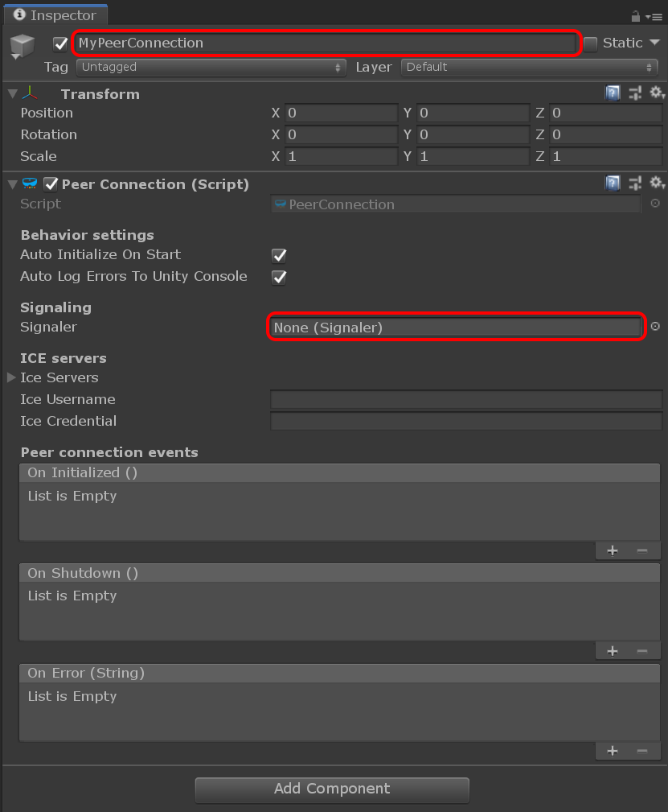

# Creating a peer connection

From this point we start building the scene. Because the MixedReality-WebRTC components are installed, and because we work now almost exclusively inside Unity, for brievety we will use the term _component_ to designate a Unity component, that is a class deriving from [`MonoBehaviour`](https://docs.unity3d.com/ScriptReference/MonoBehaviour.html).

Create a new [`GameObject`](https://docs.unity3d.com/ScriptReference/GameObject.html) with a [`PeerConnection`](xref:Microsoft.MixedReality.WebRTC.Unity.PeerConnection) component:

- In [the **Hierarchy** window](https://docs.unity3d.com/Manual/Hierarchy.html), select **Create** > **Create Empty** to add a new [`GameObject`](https://docs.unity3d.com/ScriptReference/GameObject.html) to the scene.
- In [the **Inspector** window](https://docs.unity3d.com/Manual/UsingTheInspector.html), select **Add Component** > **MixedReality-WebRTC** > **PeerConnection** to add a [`PeerConnection`](xref:Microsoft.MixedReality.WebRTC.Unity.PeerConnection) component to that new object.
- At the top of the **Inspector** window, rename the newly-created game object to something memorable like "MyPeerConnection". You can also rename this object in the **Hierarchy** window directly (for example by pressing **F2** when selected).

The [`PeerConnection`](xref:Microsoft.MixedReality.WebRTC.Unity.PeerConnection) component provided by the Unity integration of MixedReality-WebRTC has various settings to configure its behaviour. For the moment you can leave the default values.

The component has one required property however, the [`PeerConnection.Signaler`](xref:Microsoft.MixedReality.WebRTC.Unity.PeerConnection.Signaler) property, which it uses to establish a connection. This property must point to another component deriving from the base [`Microsoft.MixedReality.WebRTC.Unity.Signaler`](xref:Microsoft.MixedReality.WebRTC.Unity.Signaler) component. For the moment it points to nothing, so Unity shows "None".
