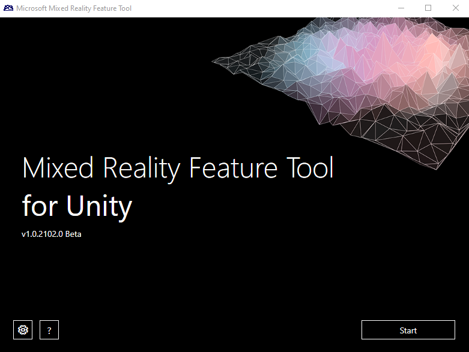

# Installation

## C# library

The C# library is consumed as a NuGet package by adding a dependency to that package in your C# project.

In Visual Studio 2019:

- Right-click on the C# project > **Manage NuGet Packages...** to open the NuGet package manager window.
- In the search bar, type "Microsoft.MixedReality.WebRTC". You may need to check the **Include prerelease** option.
- Select the NuGet package to install:
  - For a C# Desktop project, choose `Microsoft.MixedReality.WebRTC`.
  - For a C# UWP project, choose `Microsoft.MixedReality.WebRTC.UWP`.
- In the right panel, choose a version and click the **Install** button.

This will add a dependency to the currently selected C# project. If multiple projects are using the MixedReality-WebRTC library, this process must be repeated for each project.

## C/C++ library

The C/C++ library is consumed as a NuGet package by adding a dependency to that package in your C/C++ project. The C/C++ library is often referred to as the *native* library or *implementation* library.

In Visual Studio 2019:

- Right-click on the C++ project > **Manage NuGet Packages...** to open the NuGet package manager window.
- Select the **Browse** tab.
- In the search bar, type "Microsoft.MixedReality.WebRTC.Native". You may need to check the **Include prerelease** option.
- Select the NuGet package to install:
  - For a C++ Desktop project, choose `mrwebrtc`.
  - For a C++ UWP project, choose `mrwebrtc_uwp`.
- In the right panel, choose a version and click the **Install** button.

This will add a dependency to the currently selected C++ project. If multiple projects are using the MixedReality-WebRTC library, this process must be repeated for each project.

## Unity library

Starting from v2.0.0, a package named `com.microsoft.mixedreality.webrtc` is the main distribution method for the Unity library. An optional companion package `com.microsoft.mixedreality.webrtc.samples` is also available which contains some samples to show how to use the Unity library. This samples package depends on the main library package, and should not be used in production.

The library package contains prebuilt binaries for all supported Unity platforms:

- Windows Desktop (x86, x64)
- Windows UWP (x86, x64, ARM)
- Android (ARM64)

These packages are currently distributed in two ways:

- Using the [Mixed Reality Feature Tool](https://aka.ms/MRFeatureToolDocs), a free Microsoft utility to manage Mixed Reality packages for Unity. This is the recommended way, which takes care of installing any required dependency and automatically download and install the package(s) into an existing Unity project. The tool can be downloaded from https://aka.ms/MRFeatureTool.

  

- As [on-disk packages (local packages)](https://docs.unity3d.com/Manual/upm-ui-local.html) downloaded from [the GitHub Releases page](https://github.com/microsoft/MixedReality-WebRTC/releases). Follow [the official Unity instructions](https://docs.unity3d.com/Manual/upm-ui-local.html) to import the package into a Unity project via the Unity Package Manager (UPM) window.

> [!NOTE]
> If an existing Unity project manifest already contains a `Microsoft Mixed Reality` entry in the `scopedRegistries` section, is is recommended that it be removed.
