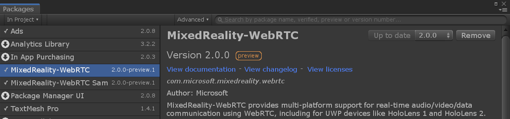
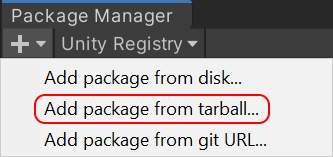
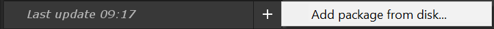

# Importing MixedReality-WebRTC

In order to use the Unity library, the following pieces are required:

- Native implementation : `mrwebrtc.dll` (one variant per platform and per architecture)
- C# library : `Microsoft.MixedReality.WebRTC.dll` (single universal module for all platforms and architectures)
- Unity library itself (scripts and assets)

The Unity library is distributed as a package containing all those components, including the prebuilt binaries for all supported Unity platforms. The library package itself, as well as the optional samples package, can be imported into an existing Unity project in two ways:

- Using the [Mixed Reality Feature Tool](https://aka.ms/MRFeatureToolDocs), a free Microsoft utility to manage Mixed Reality packages for Unity. This is the recommended way, which takes care of installing any required dependency and automatically download and install the package(s) into an existing Unity project. It can be downloaded from https://aka.ms/MRFeatureTool. A step-by-step process to discover and install Mixed Reality packages into an existing Unity project is detailed in [the official documentation](https://aka.ms/MRFeatureToolDocs).

- Manually by downloading the package(s) from [the GitHub Releases page](https://github.com/microsoft/MixedReality-WebRTC/releases). Packages imported that way are referred to by Unity as _on-disk packages_ or _local packages_, and the installation process is described in [the official Unity instructions](https://docs.unity3d.com/Manual/upm-ui-tarball.html).

> [!NOTE]
> If an existing Unity project manifest already contains a `Microsoft Mixed Reality` entry in the `scopedRegistries` section, is is recommended that it be removed.

In the following, we describe the latter method, which essentially consists in manually replicating the steps that the Mixed Reality Feature Tool would otherwise perform automatically for you.

- Download the latest release of the `com.microsoft.mixedreality.webrtc` package (`.tgz` archive) from [the GitHub Releases page](https://github.com/microsoft/MixedReality-WebRTC/releases). Direct donwload links are available at the bottom of each release section under the Assets drop-down list.

  

- Save it under a known location of your choice. At this point there is no need to unpack the archive, as Unity is able to directly import the package compressed.

- If using Unity 2018, expand the archive to a folder of your choice. Unity 2019+ supports directly installing a package from a `.tgz` archive, but this option is not available in Unity 2018.

- Open your Unity project, and in the main menu navigate to **Window** > **Package Manager**.

- In the Package Manager window:

  - For **Unity 2019+**, click on the "+" button in the _top_ left corner and select **Add package from tarball...** from the popup menu. Then select the `.tgz` archive of the `com.microsoft.mixedreality.webrtc` package downloaded earlier.

    

  - For **Unity 2018**, or if you want to install the package from an expanded archive folder, click on the "+" button located in the _bottom_ left corner and select **Add package from disk...** from the popup menu. Then select the folder where you expanded the `.tgz` archive of the `com.microsoft.mixedreality.webrtc` package downloaded earlier.

    

- Repeat the process to install the optional `com.microsoft.mixedreality.webrtc.samples` package if needed, which contains optional samples showing how to use the MixedReality-WebRTC Unity library.

----

Next : [Creating a peer connection](helloworld-unity-peerconnection.md)
