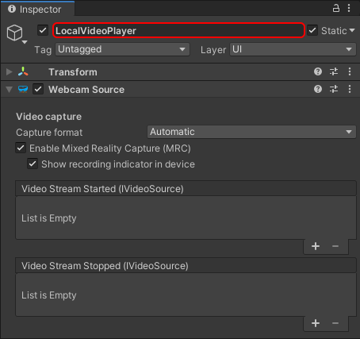
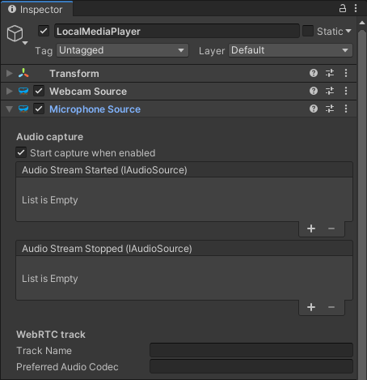
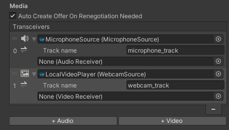

# Adding local media

In this section we perform 3 tasks:

- Add local video
- Add local audio
- Add a video renderer to render the local video

## Local video

There are three different concepts covered by the term _local video_:

1. Locally generating some video frames, often by capturing them from a _video capture device_ (_e.g._ webcam) available on the local host, or alternatively obtaining those frames by any other mean (procedurally generated, captured from another source, _etc._). This corresponds to the concept of a _video track source_ in WebRTC terminology (or simply _video source_ for short).
2. Sending those video frames to the remote peer, which is the most interesting aspect and requires WebRTC, and corresponds to the concept of _video track_ in WebRTC terminology.
3. Accessing locally the captured video frames, for example to display them for user feedback. This is application-dependent, and even within one given application can generally be toggled ON and OFF by the user. This corresponds to the concept of _video frame callback_ in MixedReality-WebRTC, and is not an official WebRTC concept from the standard.

Capturing some video feed from a local video capture device is covered by the [`WebcamSource`](xref:Microsoft.MixedReality.WebRTC.Unity.WebcamSource) component, which represents a video track source capturing its video frames from a webcam.

> [!NOTE]
> The term _webcam_ as used in the context of the [`WebcamSource`](xref:Microsoft.MixedReality.WebRTC.Unity.WebcamSource) component colloquially refers to any _local video capture device_, and is an abuse of language to shorten the latter. This term therefore includes other capture devices not strictly considered webcams, like for example the HoloLens 1 and HoloLens 2 cameras, or an Android phone built-in camera.

Because the [`WebcamSource`](xref:Microsoft.MixedReality.WebRTC.Unity.WebcamSource) component derives from the abstract [`VideoTrackSource`](xref:Microsoft.MixedReality.WebRTC.Unity.VideoTrackSource) component, which encapsulates a WebRTC video track source, that source can be attached to a media line of a peer connection. By doing so, the media line will automatically create and manage a local video track, which covers the second concept of streaming video to a remote peer.

Finally, the [`VideoTrackSource`](xref:Microsoft.MixedReality.WebRTC.Unity.VideoTrackSource) component can also be rendered locally (in parallel to being streamed to the remote peer) via an optional video player, covering the last concept if needed.

## Adding a webcam source

For clarity, we will create a new game object and add a [`WebcamSource`](xref:Microsoft.MixedReality.WebRTC.Unity.WebcamSource) component. It may sound superfluous at the moment to create a new game object, as we could add the webcam source to the same game object already owning the peer connection component, but this will prove more clear and easy to manipulate later.

- In the **Hierarchy** window, select **Create** > **Create Empty**.
- In the **Inspector** window, rename the newly-created game object to something memorable like "LocalVideoPlayer".
- Press the **Add Component** button at the bottom of the window, and select **MixedReality-WebRTC** > **Webcam Source**.

The webcam source component contains several interesting properties. We detail these properties below for reference, but for now we can leave all of them to their default values.

> [!IMPORTANT]
> When using Mixed Reality Capture (MRC) on HoloLens, the Unity project needs to be configured to **Enable XR support**. This generates an exclusive-mode application (fullscreen), which is required to get access to MRC, for security and privacy reasons. Otherwise Unity by default generates a shared application (slate app), and MRC access will be denied by the OS.

### Video capture properties

The video capture properties configure how the component accesses the webcam and captures video frames from it, independently of WebRTC.

- The **Capture format** combobox, which corresponds to the [`WebcamSource.FormatMode`](xref:Microsoft.MixedReality.WebRTC.Unity.WebcamSource.FormatMode) property, allows switching between two different modes to control how the _video capture format_ (resolution and framerate, essentially) is chosen:

  - In **Automatic** mode, the best video capture format is automatically selected.

    In general this means the first format available is chosen. On HoloLens devices, some extra steps are taken internally to force the use of the low-power video profile and reduce the capture resolution in order to save the battery and lower the CPU usage. On Android the closest resolution to 720p @ 30fps is selected.

  - In **Manual** mode, the user can apply a set of constraints to the list of capture formats the device supports.

    This allows restricting the video capture formats the selection algorithm can choose from to a subset of all the formats supported by the video capture device, and even to a single known format if needed. Note however that over-constraining the algorithm may result in no format being available, and the [`WebcamSource`](xref:Microsoft.MixedReality.WebRTC.Unity.WebcamSource) component failing to open the video capture device.

    In general it is recommended **not** to assign hard-coded resolution / framerate constraints at edit time, unless the application only targets a specific kind of device with well-known immutable capture capabilities. Instead it is recommended to enumerate at runtime with [`DeviceVideoTrackSource.GetCaptureFormatsAsync()`](xref:Microsoft.MixedReality.WebRTC.DeviceVideoTrackSource.GetCaptureFormatsAsync(System.String)) the capture formats actually supported by the video capture device, then use constraints to select one or some of those formats.

- The **Enable Mixed Reality Capture (MRC)** checkbox, which corresponds to the [`WebcamSource.EnableMixedRealityCapture`](xref:Microsoft.MixedReality.WebRTC.Unity.WebcamSource.EnableMixedRealityCapture) property, tells the component it should attempt to open the video capture device with MRC enabled, if supported. If the device does not support MRC, then this is silently ignored.

  See the important remark about MRC and exclusive mode application above.

## Local audio

The concept of _local audio_ is very similar to the one of _local video_ and can also be decomposed into generating some audio frames, sending them to a remote peer through an audio track, and optionally outputting some local feedback to the user. However currently the last part is not available; there is no local audio callback on audio track sources. This is a limitation of the underlying implementation, but has very few use cases anyway.

Capturing some audio feed from a local audio capture device is covered by the [`MicrophoneSource`](xref:Microsoft.MixedReality.WebRTC.Unity.MicrophoneSource) component, which represents an audio track capturing its audio frames from a microphone.

## Adding a microphone source

Again for clarity we will create a new game object and add a [`MicrophoneSource`](xref:Microsoft.MixedReality.WebRTC.Unity.MicrophoneSource) component.

- In the **Hierarchy** window, select **Create** > **Create Empty**.
- In the **Inspector** window, rename the newly-created game object to something memorable like "MicrophoneSource".
- Press the **Add Component** button at the bottom of the window, and select **MixedReality-WebRTC** > **Microphone Source**.

The microphone source component contains few properties. In particular there is currently a single option to configure the audio capture : enabling **Automatic Gain Control**. We can leave all properties with their default values, as it is generally a good idea to have gain automatically adjusted by the implementation.

## Adding transceivers

So far the components added are only creating audio and video track sources, but there is no link with any peer connection. This link is achieved through _transceivers_.

A _transceiver_ is a "media pipe" (audio or video) through which the peer connection transport the media between the local and remote peers. The transceivers are configured on the [`PeerConnection`](xref:Microsoft.MixedReality.WebRTC.Unity.PeerConnection) component directly, and reference the [`AudioTrackSource`](xref:Microsoft.MixedReality.WebRTC.Unity.AudioTrackSource) and [`VideoTrackSource`](xref:Microsoft.MixedReality.WebRTC.Unity.VideoTrackSource) components to be used to send media, and the [`AudioReceiver`](xref:Microsoft.MixedReality.WebRTC.Unity.AudioReceiver) and [`VideoReceiver`](xref:Microsoft.MixedReality.WebRTC.Unity.VideoReceiver) components to be used to receive media.

Let's add an audio transceiver and a video tranceiver, and attach to them the microphone and webcam sources to instruct the peer connection to send those media to the remote peer:

- In the **Hierarchy** window, select the game object with the peer connection component.
- In the **Inspector** window, under the **Transceivers** list, press the **+ Audio** and the **+ Video** to add an audio transceiver and a video transceiver, respectively.
- For the first transceiver (audio), assign the **Audio Track Source** property to the [`MicrophoneSource`](xref:Microsoft.MixedReality.WebRTC.Unity.MicrophoneSource) component created previously.
- For the second transceiver (video), assign the **Video Track Source** property to the [`WebcamSource`](xref:Microsoft.MixedReality.WebRTC.Unity.WebcamSource) component created previously.
- You can also change the sender track name by expanding the small arrow on the left of each source. This is optional; the implementation will generate a track name if none is provided.

Each transceiver displays an icon indicating the type of media (audio or video). Under that media icon, a direction icon indicates the desired direction of the transceiver based on the configured sources and receivers. Here we added a source to each transceiver, therefore the direction icon points to the right (send) only.

## Adding a video player

We said before that the [`VideoTrackSource`](xref:Microsoft.MixedReality.WebRTC.Unity.VideoTrackSource) base component can be rendered locally via a video player. The video track source exposes some C# event to access the video frames that the video track consumes (for streaming them to the remote peer); these frames can also be accessed for local rendering.

In order to simplify rendering those video frames, MixedReality-WebRTC offers a simple [`VideoRenderer`](xref:Microsoft.MixedReality.WebRTC.Unity.VideoRenderer) component which uses some Unity [`Texture2D`](https://docs.unity3d.com/ScriptReference/Texture2D.html) to render the video frames. The textures are then applied to the material of a [`Renderer`](https://docs.unity3d.com/ScriptReference/Renderer.html) component via a custom shader to be displayed in Unity on a mesh.

> [!IMPORTANT]
> The local audio captured by the [`MicrophoneSource`](xref:Microsoft.MixedReality.WebRTC.Unity.MicrophoneSource) component is directly sent to the remote peer, and unlike video there is currently no possible way to access the raw audio frames captured by this component. This is a limitation of the underlying audio capture implementation (see issue [#92](https://github.com/microsoft/MixedReality-WebRTC/issues/92)). It is anyway critical to add this component to capture the audio and send it to the remote peer.

> [!NOTE]
> Unity also has a built-in **Video Player** component; unfortunately that component is designed to play local videos from disk or from known HTTP sources, including transport management and decoding, and cannot be used to simply play already-decoded raw video frames obtained from WebRTC.

Let's add a [`VideoRenderer`](xref:Microsoft.MixedReality.WebRTC.Unity.VideoRenderer) component on our game object:

- In the **Inspector** window, press the **Add Component** button at the bottom of the window, and select **MixedReality-WebRTC** > **VideoRenderer**

This time, however, Unity will not create the component. It will instead display a somewhat complex error message:

What the message means is that the [`VideoRenderer`](xref:Microsoft.MixedReality.WebRTC.Unity.VideoRenderer) component requires a [`Renderer`](https://docs.unity3d.com/ScriptReference/Renderer.html) component on the same game object, and Unity lists all possible implementation of a renderer (all classes deriving from [`Renderer`](https://docs.unity3d.com/ScriptReference/Renderer.html)). Although all renderers might work, in our case the most simple is to add a [`MeshRenderer`](https://docs.unity3d.com/ScriptReference/MeshRenderer.html) component. If you are familiar with Unity, you also know that the renderer needs a source mesh in the form of a [`MeshFilter`](https://docs.unity3d.com/ScriptReference/MeshFilter.html) component.

So for each component, in the **Inspector** window, press the **Add Component** button at the bottom of the window, and select successively and in order:

1. **Mesh** > **Mesh Filter**
2. **Mesh** > **Mesh Renderer**
3. **MixedReality-WebRTC** > **Video Renderer**

After that, set the component properties as follows:

- In the **Mesh Filter** component, set the **Mesh** property to the built-in Unity **Quad** mesh. This is a simple square mesh on which the texture containing the video feed will be applied.
- The built-in **Quad** mesh size is quite small for rendering a video, so go to the **Transform** component and increase the scale to `(4,3,1)`. This will produce a 4:3 aspect ratio for the mesh, which is generally, if not equal to, at least pretty close to the actual video frame aspect ratio, and therefore will reduce/prevent distorsions.
- In the **Mesh Renderer** component, expand the **Materials** array and set the first material **Element 0** to the  `YUVFeedMaterial` material located in the `Runtime/Materials/` folder. This instructs Unity to use that special material and its associated shader to render the video texture on the quad mesh. More on that later.
- In the **Video Renderer** component, set the **Source** property to the webcam source component previously added to the same game object. This instructs the video renderer to connect to the webcam source for retrieving the video frames that it will copy to the video texture for rendering.

This should result in a setup looking like this:

And the **Game** view should display a black rectangle, which materializes the quad mesh:

A word about the `YUVFeedMaterial` material here. The video frames coming from the webcam source are encoded using the I420 format. This format contains 3 separate components : the luminance Y, and the chroma U and V. Unity on the other hand, and more specifically the GPU it abstracts, generally don't support directly rendering I420-encoded images. So the [`VideoRenderer`](xref:Microsoft.MixedReality.WebRTC.Unity.VideoRenderer) component is uploading the video data for the Y, U, and V channels into 3 separate [`Texture2D`](https://docs.unity3d.com/ScriptReference/Texture2D.html) objects, and the `YUVFeedMaterial` material is using a custom shader called `YUVFeedShader (Unlit)` to sample those textures and convert the YUV value to an ARGB value on the fly before rendering the quad with it. This GPU-based conversion is very efficient and avoids any software processing on the CPU before uploading the video data to the GPU. This is how [`WebcamSource`](xref:Microsoft.MixedReality.WebRTC.Unity.WebcamSource) is able to directly copy the I420-encoded video frames coming from the WebRTC core implementation into some textures without further processing, and [`VideoRenderer`](xref:Microsoft.MixedReality.WebRTC.Unity.VideoRenderer) is able to render them on a quad mesh.

## Test the local video

At this point the webcam source and the media player are configured to open the local video capture device (webcam) of the local machine the Unity Editor is running on, and display the video feed to that quad mesh in the scene. The audio is also captured from the microphone, but since there is no feedback for this, there is no opportunity to observe it.

Press the **Play** button in the Unity Editor. After a few seconds or less (depending on the device) the video should appear over the quad mesh.

----

Next : [Adding remote video](helloworld-unity-remotevideo.md)
