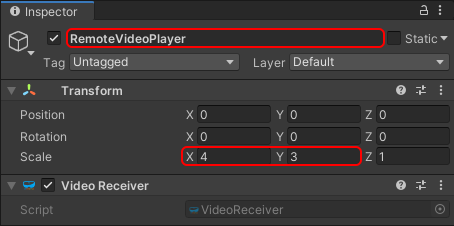
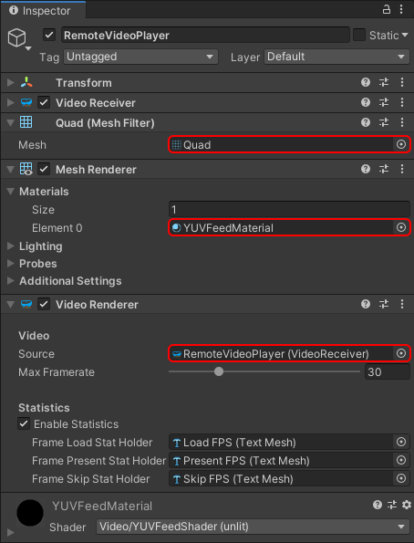
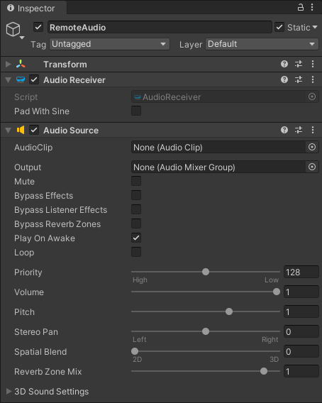
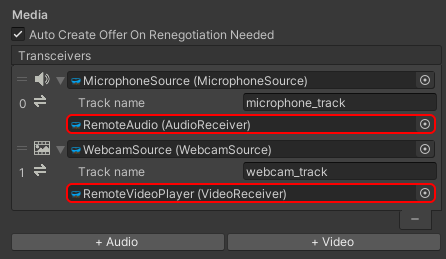

# Adding remote media

Unlike local video, the remote video track is controlled by the remote peer who will decide if and when to add the track to the connection. On the receiver side, the only thing to decide is whether or not to handle the video data received through that track. Similar observations can be made for audio.

The [`VideoReceiver`](xref:Microsoft.MixedReality.WebRTC.Unity.VideoReceiver) component is used to expose a remote video track. And similarly to the [`VideoTrackSource`](xref:Microsoft.MixedReality.WebRTC.Unity.VideoTrackSource), it can be added to a [`VideoRenderer`](xref:Microsoft.MixedReality.WebRTC.Unity.VideoRenderer) component to render the content of the video feed it receives from the remote peer. Same goes for the [`AudioReceiver`](xref:Microsoft.MixedReality.WebRTC.Unity.AudioReceiver) component for audio.

## Remote video

Like we did for the local video feed, we create a new game object with a [`VideoReceiver`](xref:Microsoft.MixedReality.WebRTC.Unity.VideoReceiver) component:

- In the **Hierarchy** window, select **Create** > **Create Empty**.
- Rename it to something memorable like "RemoteVideoPlayer".
- Go to the **Transform** component and increase the scale to `(4,3,1)` to get a 4:3 aspect ratio again.
- In the **Inspector** window, press the **Add Component** button at the bottom of the window, and select **MixedReality-WebRTC** > **Video Receiver**.

Next we add some video renderer. This is again similar to the video track source: the video receiver only exposes some frame queue which gets populated using the video frames coming from the remote peer, but the component does not do any rendering/output by itself. Instead we can use again a [`VideoRenderer`](xref:Microsoft.MixedReality.WebRTC.Unity.VideoRenderer) to render those video frames.

- The [`VideoRenderer`](xref:Microsoft.MixedReality.WebRTC.Unity.VideoRenderer) component exposes the video frames as 3 animated [`Texture2D`](https://docs.unity3d.com/ScriptReference/Texture2D.html), one for each of the YUV components, which need a mesh to be applied to. Add a **Mesh Filter** component, a **Mesh Renderer** component, and a **Video Renderer** component.
  - In the **Mesh Filter** component, set the **Mesh** property to the built-in Unity **Quad** mesh, which is the most simple mesh we can use (2 triangles) to display a texture. But any other mesh would do.
  - In the **Mesh Renderer** component, expand the **Materials** array and set the first material **Element 0** to the  `YUVFeedMaterial` material located in the `Runtime/Materials/` folder. This material uses a custom shader to convert the 3 textures of the [`VideoRenderer`](xref:Microsoft.MixedReality.WebRTC.Unity.VideoRenderer) component (YUV, one per video component) into some RGB value for rendering.
  - In the **Video Renderer** component, set the **Source** property to the video receiver component previously created.
  - We can optionally assign some text meshes to display statistics if we have some.

The **Inspector** window should now look like this:

Currently the two game objects holding the local and remote video players are located at the same position. Adjust them so that they don't overlap; for example set their X position to `X=+/-2.5`. We can also add some slight rotation to face the camera, for example `RY=+/-10`. Now we should be able to see in the **Scene** window our two black squares representing the local and remote media players:

## Remote audio

Similar to video, we create a new game object with an [`AudioReceiver`](xref:Microsoft.MixedReality.WebRTC.Unity.AudioReceiver) component:

- In the **Hierarchy** window, select **Create** > **Create Empty**.
- Rename it to something memorable like "RemoteAudio".
- In the **Inspector** window, press the **Add Component** button at the bottom of the window, and select **MixedReality-WebRTC** > **Audio Receiver**.
- The **Audio Receiver** component requires a Unity **Audio Source** component to inject the audio it receives from the remote peer into the Unity DSP pipeline for audio rendering.

## Setting up the media lines

Like for the audio and video sources, the receiver components need to be associated with the peer connection through a transceiver media line. Select the [`PeerConnection`](xref:Microsoft.MixedReality.WebRTC.Unity.PeerConnection) component again, and assign the new receivers to the audio and video media lines previously created.

----

Next : [Establishing a connection](helloworld-unity-connection.md)
