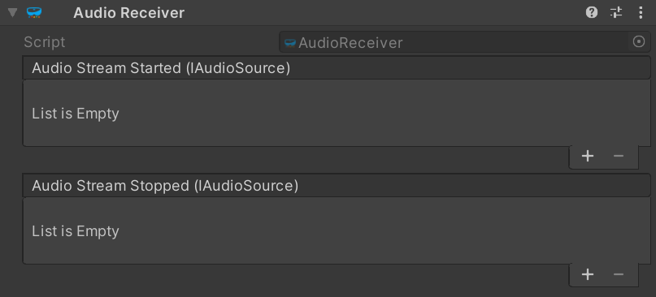

# Unity `AudioReceiver` component

The [`AudioReceiver`](xref:Microsoft.MixedReality.WebRTC.Unity.AudioReceiver) Unity component represents a single audio track received from the remote peer through an established peer connection.

The `AudioReceiver` component in itself does not render the received audio from the remote peer. Instead, it makes that audio available via the `IAudioSource` interface. To render the remote audio, add an [`AudioRenderer`](xref:Microsoft.MixedReality.WebRTC.Unity.AudioRenderer) component and assign the `AudioStreamStarted` and `AudioStreamStopped` events to its `StartRendering()` and `StopRendering()` methods, respectively.

This will allow the `AudioRenderer` to tap into the raw audio received from the remote peer, and redirect it to an `AudioSource` component located on the same `GameObject`. Note that the `AudioSource` component does not have any `AudioClip` assigned; instead the `OnAudioFilterRead()` callback is used internally by the `AudioRenderer` to inject the audio data into the `AudioSource` component, and therefore into the Unity audio DSP pipeline.

> [!NOTE]
> When using the C# library of MixedReality-WebRTC, by default remote audio tracks are automatically rendered internally to the default audio device. In Unity, the expectation instead is that all audio shall be played via the Unity DSP pipeline using the above setup. So to prevent duplicate audio playback of remote audio tracks, `PeerConnection.InitializePluginAsync()` will disable the default internal audio rendering by calling `OutputToDevice(false)` on all `RemoteAudioTrack` objects created internally.
