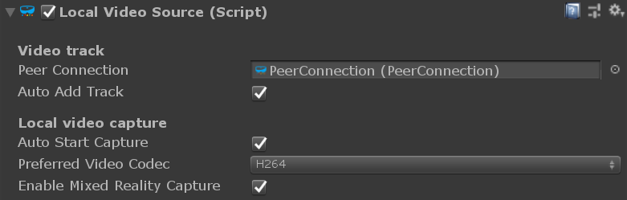

# Unity `WebcamSource` component

The [`WebcamSource`](xref:Microsoft.MixedReality.WebRTC.Unity.WebcamSource) Unity component represents a single video track source generating video frames captured from a local video capture device (webcam).

## Properties

### Video capture

#### [`WebcamDevice`](xref:Microsoft.MixedReality.WebRTC.Unity.WebcamSource.WebcamDevice) (code only)

Description of the video capture device to use, colloquially referred to as _webcam_ for short, even if other non-webcam capture devices are also supported, like the HoloLens 1 and HoloLens 2 cameras. Valid device unique identifiers can be enumerated with [`DeviceVideoTrackSource.GetCaptureFormatsAsync()`](xref:Microsoft.MixedReality.WebRTC.DeviceVideoTrackSource.GetCaptureFormatsAsync(System.String)) and correspond to the [`VideoCaptureDevice.id`](xref:Microsoft.MixedReality.WebRTC.VideoCaptureDevice.id) field. Note that this property is not exposed to the Unity editor, as devices should be enumerate at runtime to support the various video capture device configurations of the host device.

#### [`FormatMode`](xref:Microsoft.MixedReality.WebRTC.Unity.WebcamSource.FormatMode) ("Capture format" in Inspector)

Select between automated and manual video capture format selection mode. In automated mode, the implementation selects the best video capture format. In manual mode, some constraints can be specified to restrict the video capture formats the implementation might consider using, and even force one particular format.

#### [`Constraints`](xref:Microsoft.MixedReality.WebRTC.Unity.WebcamSource.Constraints) (code only)

Optional resolution and framerate constraints to apply when selecting a video capture format. This allows restricting the set of capture formats the implementation considers when selecting a capture format to use, possibly even forcing a single one. Constraints reducing the number of matching capture formats to zero will make opening the device fail, therefore it is recommended to enumerate the supported capture formats with [`DeviceVideoTrackSource.GetCaptureFormatsAsync`](xref:Microsoft.MixedReality.WebRTC.DeviceVideoTrackSource.GetCaptureFormatsAsync(System.String)).

#### [`VideoProfileId`](xref:Microsoft.MixedReality.WebRTC.Unity.WebcamSource.VideoProfileId) (code only)

[UWP only] Optional unique identifier of the video profile to use to enumerate the video capture formats. This allows selecting a video profile other than the default one, which sometimes enables access to other resolutions and framerates, and is required on HoloLens 2 to use the low-power capture formats. It is recommended to specify either `VideoProfileId` or `VideoProfileKind`, but not both.

#### [`VideoProfileKind`](xref:Microsoft.MixedReality.WebRTC.Unity.WebcamSource.VideoProfileKind) (code only)

[UWP only] Optional video profile kind to use to enumerate the video capture formats. This allows selecting a video profile other than the default one, which sometimes enables access to other resolutions and framerates, and is required on HoloLens 2 to use the low-power capture formats. It is recommended to specify either `VideoProfileId` or `VideoProfileKind`, but not both.

#### [`EnableMixedRealityCapture`](xref:Microsoft.MixedReality.WebRTC.Unity.WebcamSource.EnableMixedRealityCapture)

[UWP only] On platforms supporting Mixed Reality Capture (MRC) like HoloLens 1st generation and 2nd generation, instruct the video capture module to enable this feature and produce a video stream containing the holograms rendered over the raw webcam feed. This has no effect if the local device does not support MRC.

#### [`EnableMRCRecordingIndicator`](xref:Microsoft.MixedReality.WebRTC.Unity.WebcamSource.EnableMRCRecordingIndicator)

[UWP only] On platforms supporting Mixed Reality Capture (MRC) like HoloLens 1st generation and 2nd generation, and when `EnableMixedRealityCapture` is `true`, enable the on-screen recording indicator (red circle) on the device while the camera is capturing.

#### [`VideoStreamStarted`](xref:Microsoft.MixedReality.WebRTC.Unity.VideoTrackSource.VideoStreamStarted)

Event raised when the video track source starts capturing frames.

#### [`VideoStreamStopped`](xref:Microsoft.MixedReality.WebRTC.Unity.VideoTrackSource.VideoStreamStopped)

Event raised when the video track source stops capturing frames.
