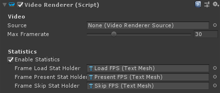

# Unity `VideoRenderer` component

The [`VideoRenderer`](xref:Microsoft.MixedReality.WebRTC.Unity.VideoRenderer) Unity component is a utility component to render some video frames into a Unity texture.

To use the component, either call its [`StartRendering()`](xref:Microsoft.MixedReality.WebRTC.Unity.VideoRenderer.StartRendering(IVideoSource)) and [`StopRendering()`](xref:Microsoft.MixedReality.WebRTC.Unity.VideoRenderer.StopRendering(IVideoSource)) methods from code, or connect them to Unity events such as the [`VideoTrackSource.VideoStreamStarted`](xref:Microsoft.MixedReality.WebRTC.Unity.VideoTrackSource.VideoStreamStarted) and [`VideoTrackSource.VideoStreamStopped`](xref:Microsoft.MixedReality.WebRTC.Unity.VideoTrackSource.VideoStreamStopped) events. All video source components derive from [`VideoTrackSource`](xref:Microsoft.MixedReality.WebRTC.Unity.VideoTrackSource) and therefore expose those events.

| Property | Description |
|---|---|
| **Video** | |
| MaxFramerate | Maximum number of video frames per second rendered. Extra frames coming from the video source passed to [`StartRendering()`](xref:Microsoft.MixedReality.WebRTC.Unity.VideoRenderer.StartRendering(IVideoSource)) are discarded. |
| **Statistics** | |
| EnableStatistics | Enable the collecting of video statistics by the media player. This adds some minor overhead. |
| FrameLoadStatHolder | Reference to a [`TextMesh`](https://docs.unity3d.com/ScriptReference/TextMesh.html) instance whose text is set to the number of incoming video frames per second pulled from the video source into the media player's internal queue. |
| FramePresentStatHolder | Reference to a [`TextMesh`](https://docs.unity3d.com/ScriptReference/TextMesh.html) instance whose text is set to the number of video frames per second dequeued from the media player's internal queue and rendered to the texture(s) of the [`Renderer`](https://docs.unity3d.com/ScriptReference/Renderer.html) component associated with this media player. |
| FrameSkipStatHolder | Reference to a [`TextMesh`](https://docs.unity3d.com/ScriptReference/TextMesh.html) instance whose text is set to the number of video frames per second dropped due to the media player's internal queue being full. This corresponds to frames being enqueued faster than they are dequeued, which happens when the source is overflowing the sink, and the sink cannot render all frames. |

----

_See also :_

- [`VideoTrackSource`](xref:Microsoft.MixedReality.WebRTC.Unity.VideoTrackSource)
- [`WebcamSource`](xref:Microsoft.MixedReality.WebRTC.Unity.WebcamSource)
- [`SceneVideoSource`](xref:Microsoft.MixedReality.WebRTC.Unity.SceneVideoSource)