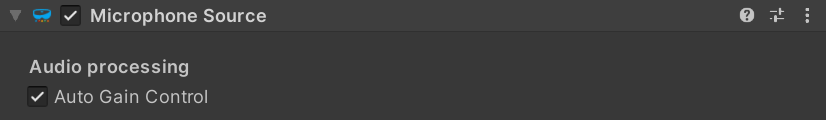
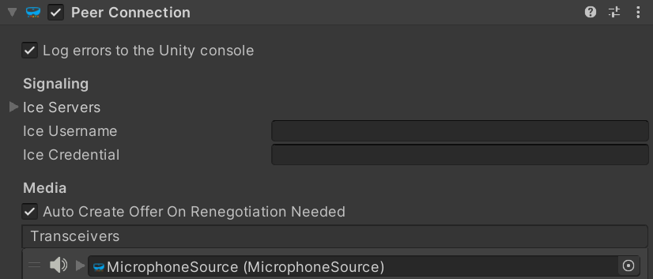

# Unity `MicrophoneSource` component

The [`MicrophoneSource`](xref:Microsoft.MixedReality.WebRTC.Unity.MicrophoneSource) Unity component represents a single audio track obtaining its data from a local audio capture device (microphone). The component controls both the capture device and the track it feeds.

The **Auto Gain Control** property allows enabling automated gain control (AGC), an audio processing step which dynamically raises or lowers the audio gain to attempt to maintain a constant volume.

The `MicrophoneSource` must be added to an audio transceiver of a [`PeerConnection`](xref:Microsoft.MixedReality.WebRTC.Unity.PeerConnection) component to allow that peer connection to send the recorded audio to the remote peer.

