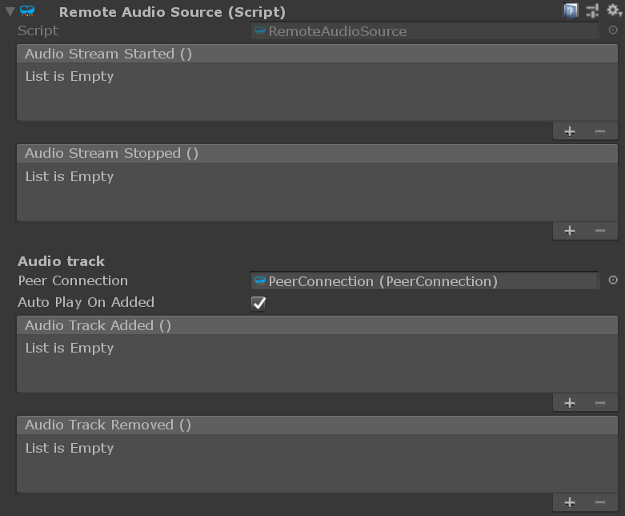

# Unity `AudioReceiver` component

The [`AudioReceiver`](xref:Microsoft.MixedReality.WebRTC.Unity.AudioReceiver) Unity component represents a single audio track received from the remote peer through an established peer connection.

> [!Important]
> FIXME: This component is not currently functional. The remote audio data is currently sent directly to the local device audio output (speakers) by the internal WebRTC implementation without any configuration possible. See issue [#92](https://github.com/microsoft/MixedReality-WebRTC/issues/92) for details.
