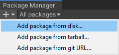

# MixedReality-WebRTC for Unity

MixedReality-WebRTC for Unity (`com.microsoft.mixedreality.webrtc`) is a package for [Unity](https://unity.com/) to help mixed reality app developers integrate peer-to-peer real-time audio, video, and data communication into their application, and improve their collaborative experience.

## Features

- Enables **multi-track real-time audio / video / data communication** with a remote peer. Multiple connections can be used in parallel to communicate with multiple peers.
- Provides drop-in components for:
  - Peer connection and automated media tracks management
  - Local audio and video capture from **webcam** and **microphone**
  - Remote audio output via an AudioSource component, for **2D and spatial audio**
  - Remote video rendering through a Unity texture, for use on any mesh
  - **Scene video streaming** from any Unity Camera component (stream-what-you-see)
- Supports in-editor use (Play mode)
- Supports UWP devices, including Microsoft **HoloLens** (x86) and Microsoft **HoloLens 2** (ARM)
- Allows easy use of **[Mixed Reality Capture (MRC)](https://docs.microsoft.com/en-us/windows/mixed-reality/mixed-reality-capture)** to stream the view point of the user for multi-device experiences

MixedReality-WebRTC for Unity is part of the open-source [MixedReality-WebRTC](https://github.com/microsoft/MixedReality-WebRTC/) project hosted on GitHub, and leverages the C# library and native implementation of that project.

## Install

This package can be imported directly into an existing Unity project as a custom package:

- Open Unity and load the Unity project to add the MixedReality-WebRTC library to.

- Download the latest package from [the GitHub Releases page](https://github.com/microsoft/MixedReality-WebRTC/releases) and unzip it somewhere on your local hard disk.

- Go to the **Package Manager** window (_Window_ > _Package Manager_)

- Expand the "+" menu and select "_Add package from disk..._"

  

  _Note: In Unity 2018.4, the "+" menu is located at the bottom left of the Package Manager window._

- Select the `package.json` file from the place where the package was unzipped.

This installs the package and add a reference in the currently open Unity project.

See Unity's documentation on [Installing a local package](https://docs.unity3d.com/Manual/upm-ui-local.html) for more details.

## Documentation

The official documentation of the MixedReality-WebRTC project is hosted at [https://microsoft.github.io/MixedReality-WebRTC/manual/unity-integration.html](https://microsoft.github.io/MixedReality-WebRTC/manual/unity-integration.html).

An API reference is also available at [https://microsoft.github.io/MixedReality-WebRTC/api/Microsoft.MixedReality.WebRTC.Unity.html](https://microsoft.github.io/MixedReality-WebRTC/api/Microsoft.MixedReality.WebRTC.Unity.html)

## Samples

Official samples are hosted in a separate package (`com.microsoft.mixedreality.webrtc.samples`) also available from [the GitHub Releases page](https://github.com/microsoft/MixedReality-WebRTC/releases).

## Special considerations for HoloLens 2

- Mixed Reality Capture (MRC) has some inherent limitations:
  - **MRC only works up to 1080p** (see the [Mixed reality capture for developers](https://docs.microsoft.com/en-us/windows/mixed-reality/mixed-reality-capture-for-developers) documentation), but the default resolution of the webcam on HoloLens 2 is 2272 x 1278 (see the [Locatable Camera](https://docs.microsoft.com/en-us/windows/mixed-reality/locatable-camera) documentation). In order to access different resolutions, one need to use a different video profile, like the `VideoRecording` or `VideoConferencing` ones. This is handled automatically in the Unity integration layer (see [here](https://github.com/microsoft/MixedReality-WebRTC/blob/9a81c94cf01786398495f8046b645b7b28d987de/libs/Microsoft.MixedReality.WebRTC.Unity/Assets/Microsoft.MixedReality.WebRTC.Unity/Scripts/Media/LocalVideoSource.cs#L210-L237)) if `LocalVideoSource.Mode = Automatic` (default), but must be handled manually if using the C# library directly.
  - **MRC requires special permission** to record the content of the screen:
    - For shared apps (2D slates), this corresponds to the `screenDuplication` [restricted capability](https://docs.microsoft.com/en-us/windows/uwp/packaging/app-capability-declarations#restricted-capabilities), which **cannot be obtained by third-party applications**.
    - For exclusive-mode apps (fullscreen), there is no particular UWP capability, but the recorded content is limited to the application's own content.
- Be sure to use `PreferredVideoCodec = "H264"` to avail of the hardware encoder present on the device; software encoding with _e.g._ VP8 or VP9 codecs is very CPU intensive and strongly discouraged.

## Known Issues

The current version is under active development, and contains known issues inherited from the underlying C# library of the MixedReality-WebRTC sister project:

- HoloLens 2 exhibits some small performance penalty due to the [missing support (#157)](https://github.com/webrtc-uwp/webrtc-uwp-sdk/issues/157) for SIMD-accelerated YUV conversion in WebRTC UWP SDK on ARM.
- H.264 hardware video encoding (UWP only) exhibits some quality degrading (blockiness). See [#74](https://github.com/microsoft/MixedReality-WebRTC/issues/74) and [#101](https://github.com/microsoft/MixedReality-WebRTC/issues/101) for details.
- H.264 is not currently available on Desktop. Only VP8 and VP9 are available instead (software).

## Contributing

This project welcomes contributions and suggestions.  Most contributions require you to agree to a Contributor License Agreement (CLA) declaring that you have the right to, and actually do, grant us the rights to use your contribution. For details, visit [https://cla.microsoft.com](https://cla.microsoft.com).

When you submit a pull request, a CLA-bot will automatically determine whether you need to provide a CLA and decorate the PR appropriately (_e.g._, label, comment). Simply follow the instructions provided by the bot. You will only need to do this once across all repos using our CLA.

This project has adopted the [Microsoft Open Source Code of Conduct](https://opensource.microsoft.com/codeofconduct/). For more information see the [Code of Conduct FAQ](https://opensource.microsoft.com/codeofconduct/faq/) or contact [opencode@microsoft.com](mailto:opencode@microsoft.com) with any additional questions or comments.

## Reporting security issues and bugs

MixedReality-WebRTC-Unity builds upon the WebRTC implementation provided by Google. Security issues and bugs related to this implementation should be reported to Google.

Security issues and bugs related to MixedReality-WebRTC and MixedReality-WebRTC-Unity themselves, or to WebRTC UWP SDK, should be reported privately, via email, to the Microsoft Security Response Center (MSRC) secure@microsoft.com. You should receive a response within 24 hours. If for some reason you do not, please follow up via email to ensure we received your original message. Further information, including the MSRC PGP key, can be found in the [Security TechCenter](https://technet.microsoft.com/en-us/security/ff852094.aspx).
