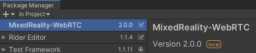

# MixedReality-WebRTC for Unity - Samples

MixedReality-WebRTC for Unity - Samples (`com.microsoft.mixedreality.webrtc.samples`) is a companion package for [Unity](https://unity.com/) which provides samples to help developers learn and use the MixedReality-WebRTC for Unity (`com.microsoft.mixedreality.webrtc`) package.

## Install

This package can be imported directly into an existing Unity project as a custom package:

- Open Unity and load the Unity project to add the MixedReality-WebRTC samples to.

- Download the latest package from [the GitHub Releases page](https://github.com/microsoft/MixedReality-WebRTC/releases) and unzip it somewhere on your local hard disk.

- Go to the **Package Manager** window (_Window_ > _Package Manager_)

- Expand the "+" menu and select "_Add package from disk..._"

  

  _Note: In Unity 2018.4, the "+" menu is located at the bottom left of the Package Manager window._

- Select the `package.json` file from the place where the package was unzipped.

This installs the package and add a reference in the currently open Unity project.

See Unity's documentation on [Installing a local package](https://docs.unity3d.com/Manual/upm-ui-local.html) for more details.

> **⚠ Scene loading bug in Unity 2018.4 ⚠**
>
> Unity 2018.4 has a bug where scenes from custom packages cannot be loaded by default. [This is fixed in Unity 2019.1](https://forum.unity.com/threads/cant-save-scenes-into-packages-cant-load-scenes-from-packages.590764/#post-4127551). As a workaroud to open the sample scenes contained in this package, use **Load As Additive** (from the scene context menu, right-clicking on the scene), or upgrade to Unity 2019.1+.

## Documentation

The official documentation of the MixedReality-WebRTC project is hosted at [https://microsoft.github.io/MixedReality-WebRTC/manual/unity-integration.html](https://microsoft.github.io/MixedReality-WebRTC/manual/unity-integration.html).

An API reference is also available at [https://microsoft.github.io/MixedReality-WebRTC/api/Microsoft.MixedReality.WebRTC.Unity.html](https://microsoft.github.io/MixedReality-WebRTC/api/Microsoft.MixedReality.WebRTC.Unity.html)

## Samples

### StandaloneDemo

The `StandaloneDemo` sample scene is a self-contained demo scene showing the use of the multi-track API to connect two `PeerConnection` components representing two different peers.

For simplicity, and to avoid requiring any external setup, this demo contains both peers in the same Unity scene, and uses a simple local-only in-process signaler implementation which pass signaling messages between the two `PeerConnection` components located in the same Unity scene as the signaler itself. This is of course not representative of a real-world application, but provides a simple introduction to the WebRTC concepts and the MixedReality-WebRTC for Unity components without the burden of networking.

### VideoChatDemo

The `VideoChatDemo` sample scene shows how to create a simple audio and video chat client.

Compared to the `StandaloneDemo`, this demo represents a more concrete example of application and allows two clients located remotely on different machines to communicate, at the expense of requiring some external setup for signaling.

The demo uses the `NodeDssSignaler`, which is a simple signaler solution for testing and debuggin based on the NodeJS-based [`node-dss`](https://github.com/bengreenier/node-dss) server. Note however that this is not a production-ready solution, and it provides no security guarantee (plain text connection over HTTP).

## Contributing

This project welcomes contributions and suggestions.  Most contributions require you to agree to a Contributor License Agreement (CLA) declaring that you have the right to, and actually do, grant us the rights to use your contribution. For details, visit [https://cla.microsoft.com](https://cla.microsoft.com).

When you submit a pull request, a CLA-bot will automatically determine whether you need to provide a CLA and decorate the PR appropriately (_e.g._, label, comment). Simply follow the instructions provided by the bot. You will only need to do this once across all repos using our CLA.

This project has adopted the [Microsoft Open Source Code of Conduct](https://opensource.microsoft.com/codeofconduct/). For more information see the [Code of Conduct FAQ](https://opensource.microsoft.com/codeofconduct/faq/) or contact [opencode@microsoft.com](mailto:opencode@microsoft.com) with any additional questions or comments.

## Reporting security issues and bugs

MixedReality-WebRTC-Unity builds upon the WebRTC implementation provided by Google. Security issues and bugs related to this implementation should be reported to Google.

Security issues and bugs related to MixedReality-WebRTC and MixedReality-WebRTC-Unity themselves, or to WebRTC UWP SDK, should be reported privately, via email, to the Microsoft Security Response Center (MSRC) secure@microsoft.com. You should receive a response within 24 hours. If for some reason you do not, please follow up via email to ensure we received your original message. Further information, including the MSRC PGP key, can be found in the [Security TechCenter](https://technet.microsoft.com/en-us/security/ff852094.aspx).
