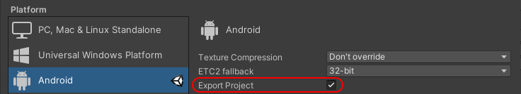
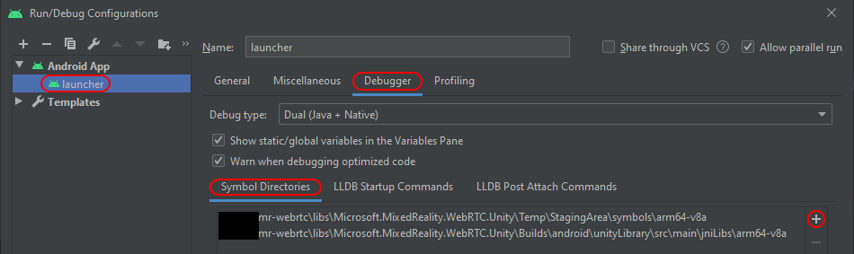
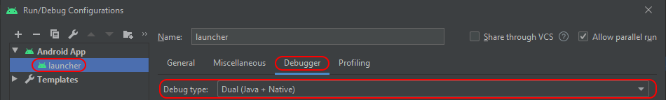

# Native debugging with Android Studio

This assumes that an Android Studio project was generated with Unity, which is done by ticking the **Export Project** checkbox in the **Build Settings** dialog of Unity.



## Setup IL2CPP debug symbols

IL2CPP compiles C# code into a native `libil2cpp.so` library, and puts the debug symbols in separate files `libil2cpp.dbg.so` and `libil2cpp.sym.so`. In order for LLDB to find those symbols, the easiest is to copy those files next to the library itself.

- Open the Unity Editor and generate the Android Studio project. **Leave the Editor open**, because the files needed are only kept in the `Temp/` folder while the Editor is open, and will get deleted after that.
- Copy all files in `Temp\StagingArea\symbols\arm64-v8a` into the Android Studio generated project's `unityLibrary\src\main\jniLibs\arm64-v8a` folder:
  - `libil2cpp.dbg.so`
  - `libil2cpp.sym.so`
  - `libunity.sym.so`
- Continue to leave the Editor open during debugging because the `.cpp` files are also in the `Temp/` folder, and for easier debugging (setting breakpoint and stepping through C++ code) they are needed. Alternatively they can be copied somewhere else outside of the `Temp/` folder.

_WARNING_ : Setting a breakpoint visually on a C++ file by clicking in the left gutter or using keyboard shortcut doesn't seem to work, likely because Android Studio or LLDB uses the local path without taking into account source remapping, therefore cannot match the file/line with an actualy module, and cannot create the actual breakpoint. Use the `br set -n <function_name>` or other variants of the `breakpoint` LLDB command to set breakpoints from the LLDB console instead.

The Unity support [describes some custom post-process step](https://support.unity3d.com/hc/en-us/articles/115000177543-Where-I-can-get-the-symbols-file-for-the-libil2cpp-so-library-in-an-Android-IL2CPP-build-to-symbolicate-call-stacks-from-crashes-on-my-production-builds-) to copy the debug symbols files above, which can also be used to copy the C++ files.

In Android Studio:

- Open the **Run/Debug Configurations** dialog from the **Run** > **Edit configurations...** menu.
- In the left pane, select **Android App** > **launcher**.
- In the right pane, select the **Debugger** tab.
- In **Symbol Directories**, add the path to the generated project's `unityLibrary\src\main\jniLibs\arm64-v8a` folder.

_Note:_ TODO to confirm whether this is actually needed; it doesn't hurt anyway.



## Configure debugger type

- Same as above, open the **Debugger** tab of the **Run/Debug Configurations** dialog.
- Change **Debug type** to:
  - **Native Only** for debugging only C++.
  - **Dual (Java + Native)** to debug both C++ and Java at the same time. This allows launching two separate debuggers in parallel when the application starts, the Java debugger and the C++ debugger (LLDB).



## Ensure library is built with debug symbols

On Android, and more generally on \*nix platforms, the debug symbols are often embedded into the shared modules (`*.so`) instead of being in a separate file like on Windows (`*.pdb`). This is currently the case for `libmrwebrtc.so`.

Alternatively the symbols can also be located in a separate file (`*.dbg.so` and/or `*.sym.so`). This is the case for the `libil2cpp.so` library generated by IL2CPP from the C# source code, as well as for Unity's own `libunity.so`.

### Generic Linux commands

#### Check for debug symbols

To confirm whether a shared library was built with debug symbols, use the `file` Linux command:

```sh
$ cd tools/build/android/webrtc-native/build/intermediates/cmake/debug/obj/arm64-v8a/
$ file libmrwebrtc.so
libmrwebrtc.so: ELF 64-bit LSB shared object, ARM aarch64, version 1 (SYSV), dynamically linked, BuildID[sha1]=<...>, with debug_info, not stripped
```

The interesting parts are the last 2 results `with debug_info` and `not stripped` indicating debug symbols are present. A shared library compiled without debug symbols would show `stripped` instead.

For static archives (`.a`) like `libwebrtc.a`, the `file` command does not give this information. Instead, use the `nm` command to list debug symbols, and `grep` to filter:

```sh
$ cd webrtc/src/out/android/arm64/Debug/obj
$ nm --debug-syms libwebrtc.a | grep ' N '
<a bunch of lines>
$ cd ../../Release/obj
$ nm --debug-syms libwebrtc.a | grep ' N '
<nothing>
```

#### Check if symbol is exported

Somewhat related, to check if a symbol is exported (_e.g._ when debugging a link error), use the `nm` Linux command to list exported symbols (`-g`) and optionally demangle the C++ names (`-C`).

```sh
nm -g libmrwebrtc.so
nm -gC libmrwebrtc.so
```

### Configuration of `libwebrtc.a`

The `libwebrtc` library is statically linked via its archive file `libwebrtc.a` into the final `libmrwebrtc.so`.

By default the debug configuration (`is_debug = true` in `args.gn`) contains debug symbols, and the release configuration doesn't.

### Configuration of `libmrwebrtc.so`

The `libmrwebrtc` library links statically against the `libwebrtc` into a shared module `libmrwebrtc.so`, which is then embedded into an Android archive `mrwebrtc.aar`.

By default the debug configuration contains debug symbols, and the release configuration doesn't.

In details, the Android Gradle native project which builds `libmrwebrtc.so` is configured via `tools/build/android/webrtc-native/build.gradle`, which defines 2 build variants:

- `debug`, which has the `debuggable true` option
- `release`, which doesn't have it

This means that when using the `debug` build variant the debugging symbols will be embedded inside the `libmrwebrtc.so` shared library, which is then itself packaged into the `mrwebrtc.aar` Android archive. And conversely when using the `release` build variant, the debug symbols will be stripped from the final shared library before is packaged into the `.aar` archive.

## Configure source path remapping

Generally the Android archive `mrwebrtc.aar` is built on Linux (mandatory) but subsequently used on Windows because there is currently no Unity editor for Linux. Therefore the source paths embedded with the debug symbols inside `libmrwebrtc.so` will be the Linux paths, and cannot be used when debugging with Android Studio on Windows.

LLDB allows remapping some folders for this scenario with the `source-map` option:

```sh
lldb> settings set target.source-map /buildbot/path /my/path
```

More concretely when building on Linux and debugging on Windows, this looks something like:

```sh
lldb> settings set target.source-map ~/mr-webrtc/libs/mrwebrtc D:\mr-webrtc\libs\mrwebrtc
```

To confirm the original source path, ask lldb:

```sh
lldb> image lookup -vn mrsPeerConnectionAddTransceiver libmrwebrtc.so
CompileUnit: id = {0x...}, file = "<original path to cpp filename>"
```

For the setting to be taken into account at LLDB startup and be persistent across debugging session, add the settings command to the LLDB startup commands:

- In Android Studio, open once again the **Debugger** tab of the **Run/Debug Configurations** window.
- Below the debug type, select the **LLDB Startup Commands** tab.
- Enter the settings command(s) to remap the source folders, _e.g._
  - `settings set target.source-map /home/username/mr-webrtc/libs/mrwebrtc D:\mr-webrtc\libs\mrwebrtc`

This ensures the command is run each time LLDB starts, which makes the mapping available for all debug sessions.

WARNINGS:

- **Overwrite vs. append**: `settings set target.source-map` overwrites the existing map. To append an entry (_e.g._ after the first one) use `settings append target.source-map` instead. So usually use `set` on the first line and `append` on all subsequent ones. See [this lldb-dev thread](http://lists.llvm.org/pipermail/lldb-dev/2017-August/012663.html) for info.
- **String prefix match**: The source path (first argument) is **matched by string prefix and not by path**; that is, `a/../b/x`, `b/x`, and `b\x` are all different, and only the exact match that is in the debug info should be used (see `image lookup -vn <function_name>` to find the exact path syntax).
- **Do not use multiple rules**: The last _path match_ (match by path as any OS would do, including `..` resolve) overwrites the previous _path match_, then will fail if it is not a _string prefix match_ (as defined above). This is the most confusing rule, and looks like a bug in Android Studio and/or LLDB. Consider 2 remap rules, in order:

  - `/home/user/path/to/webrtc/src/out/android/arm64/Debug/../../../../pc` -> `d:\webrtc\src\pc`
  - `/home/user/path/to/webrtc/src/pc` -> `d:\webrtc\src\pc`

  They are both _path matches_ for the `pc` folder, since both paths resolve to the same thing, and the second one will overwrite the first one (at least it seems that this is what happens internally). But then if the actual path written in the debug info has the first form (the one with `..`) then the second rule is not a _string prefix match_ (see previous warning above). As a result the remap fails and source debugging is not available, even though the first rule should make it work.

## Launch with debugger

Launch the debugger by clicking on the Debug icon (Shift + F9) instead of the normal Run icon (Shift + F10).

WARNING: It may take quite a while for LLDB to load all modules. See the status bar at the very bottom of Android Studio to see if LLDB is loading some modules. During this time the Android application is suspended with a dialog "Waiting for debugger".

## Access LLDB console

- Open the **Debug** panel with the **View** > **Tool Windows** > **Debug** menu (Alt+5)
- In the panel, select at the top the native debugger. In dual debug type there are 2 tabs open, **launcher-java** for Java debugging and **launcher** for native debugging with LLDB. Select the latter.
- In the sub-tab just below select **Debugger** and not **Console**
- There should be an **LLDB** window appearing somewhere below in that **Debug** panel, possibly docked with the **Variables** one. This gives command-line access to LLDB.

## Visual breakpoints

Opening one of the C++ files, it is possible in theory to directly set a breakpoint on a line (red dot in left gutter). This does not always work. While the debugger is attached to the running application, breakpoints that could not be set appear as a grey interdiction sign instead of the usual red dot. Conversely, breakpoints that were successfully created appear as a red dot with a tiny check mark. When LLDB is not running, all breakpoints appear the same, and there is no way to tell if LLDB will be able to bind them when the application runs. As a fallback, breakpoints can be set with the LLDB prompt and the `br` / `breapoint` command.

## General tips and tricks

### LLDB command shortcut

LLDB commands are generally quite long to type, but most can be shortened as commands are disambiguated only on the first few characters and don't need a full match for LLDB to recognize them; LLDB will always pick the unambiguous command with a matching prefix.

Examples:

- `breakpoint` -> `br`
- `image lookup` -> `im loo`
- _etc._

### Line wrap

IL2CPP tends to generate very long identifiers, which in turn produce very long lines. Wrapping lines around avoids having to scroll horizontally. Toggle wrap with **View** > **Active Editor** > **Soft-Wrap**, or globally with **File** > **Settings** > **Editor** > **General** for some or all file extensions.

## Useful LLDB commands

See the [LLDB tutorial](https://lldb.llvm.org/use/tutorial.html) for some more detailed explanations. This is more of a cheat sheet / memo than an actual documentation.

- `bt` / `backtrace` : Show the current callstack
- `br` / `breapoint`
  - `br list` : List existing breakpoints
  - `br set ...` : Set a breapoint (see `help br set` for options)
- `up 3` / `down 2` : Move the frame cursor in the current callstack
- `l` / `source list` : Show the sources at the current frame
- `l 59` : Show the sources at the current frame starting from line 59 of the file
- `image lookup -vn mrsPeerConnectionCreate` : Find the given function by name. This displays some symbol info and allows checking whether LLDB found the debug symbols for that function (and therefore for the library it is contained in). Shortcut `im loo -vn <function_name>`. The `CompileUnit` results shows the original build path of the C++ file, and should be used to setup the source path remapping.
- `disassemble` / `dis`
  - `dis -f` : Disassemble the entire current frame (usually, the current function)
  - `dis -p` : Disassemble a few lines around the current instruction (program counter PC)
- Show disassembly, see [here](https://stackoverflow.com/questions/33333165/how-to-switch-between-source-code-debug-mode-and-disassembly-debug-mode-in-lldb)
- `j *0x1234abcd` : Move PC to the given address (equivalent to "Jump to cursor" in Visual Studio). This is dangerous.
- `p` / `print`
  - `p $x0` : Print the content of the `x0` register (default = decimal value).
  - `p/x $x1` : Print the content of the `x1` register as an hexadecimal value.